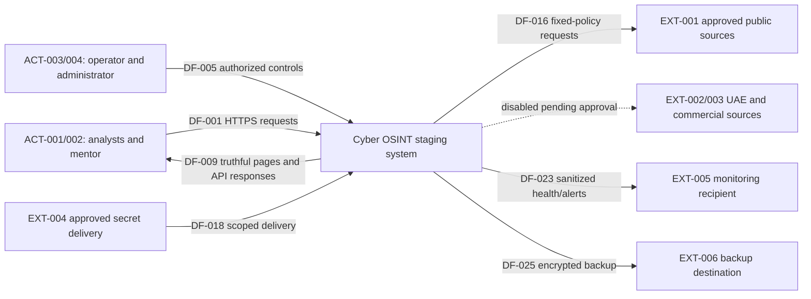
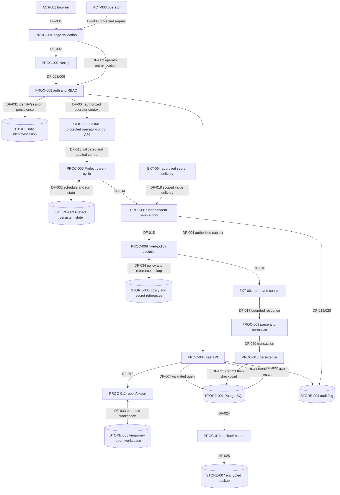

# B0-06 Data-Flow Model

## 1. Document control

| Field | Value |
| --- | --- |
| Task | B0-06 — Create production architecture and threat model |
| Status | Proposed data-flow model pending independent review |
| Checkpoint | `46e85607fce7c39d6ea33ce29bd39a0560858ef0` |
| Prepared | 30 July 2026 |
| Architecture source | `docs/b0-06-production-architecture.md` |

## 2. Method and notation

The model uses actors (`ACT`), processes (`PROC`), stores (`STORE`), external
entities (`EXT`), flows (`DF`) and data classes (`DATA`). Solid diagram arrows
show required allowed flows; dashed arrows show disabled or conditional flows.
The same trust-boundary (`TB`) and invariant (`INV`) identifiers are used across
all B0-06 documents. Current and target states are never interchangeable.

Every target flow assumes validation before use, backend authorization before a
protected operation, sanitized errors, bounded resources and auditable state.

## 3. Actors

| ID | Actor | Current state | Target authority |
| --- | --- | --- | --- |
| ACT-001 | Analyst/viewer | Public unauthenticated reader | Authenticated Viewer or Analyst with bounded query/search rights |
| ACT-002 | Mentor/release reviewer | External reviewer of artifacts | Authenticated mentor role and APR-15 decision-maker where authorized |
| ACT-003 | Ingestion operator | Developer running manual CLIs | Authenticated Ingestion Operator for run/retry/pause/enable/disable |
| ACT-004 | Administrator | Not implemented | Authenticated Administrator for users, roles and protected configuration |
| ACT-005 | Scheduled service identity | Not implemented | Prefect server/worker and per-service identities with minimum privileges |

## 4. Processes

| ID | Process | Current state | Required target behaviour |
| --- | --- | --- | --- |
| PROC-001 | Edge request handling | Absent | TLS, host validation, request bounds and routing |
| PROC-002 | Next.js rendering | Implemented for Overview/details | Twelve truthful role-aware pages; safe text/URL rendering |
| PROC-003 | Authentication/session and RBAC | Absent | Unique identity, revocable session and backend permission decision |
| PROC-004 | FastAPI query handling | Implemented GET-only | Validate, authorize and serialize allow-listed responses |
| PROC-005 | Operator-control API | Absent | Authorize, validate and audit run/retry/pause/enable/disable |
| PROC-006 | Parent ingestion cycle | Absent | One non-overlapping two-hour cycle subject to APR-06 |
| PROC-007 | Independent source flow | Manual CLIs implemented | Isolated observable flow for each enabled source |
| PROC-008 | Fixed-policy resolution | Implemented for current sources | Server-selected source, exact HTTPS endpoint and closed request policy |
| PROC-009 | Fetch, parse and normalize | Implemented per source | Bound response, validate schema/content, normalize and preserve provenance |
| PROC-010 | Transactional persistence/checkpoint | Implemented in manual paths with gaps | Commit complete persistence before checkpoint movement |
| PROC-011 | Report/export generation | Absent | Authorized bounded CSV/PDF with formula protection |
| PROC-012 | Audit, logging and health | Partially implemented | Correlated, sanitized actor/state/health evidence without secrets |
| PROC-013 | Backup/restore | Absent | Encrypted backup, integrity proof and isolated compatible restore |

## 5. Data stores

| ID | Store | Data | Current state | Target access rule |
| --- | --- | --- | --- | --- |
| STORE-001 | PostgreSQL application database | Intelligence, provenance, sources, runs, checkpoints | Implemented, 13 mapped tables | Application DML identity; migration identity separate |
| STORE-002 | Identity/session store | Users, roles, revocable sessions | Absent | Authentication service only; no raw session exposure |
| STORE-003 | Prefect persistent state | Schedules, deployments, flow/run state | Absent | Protected server/worker and FastAPI operator-control service access; no normal operator direct access |
| STORE-004 | Audit/log store | Correlation, actor/action/result, sanitized categories | Partial request/run logging | Restricted readers, bounded retention and immutable history |
| STORE-005 | Report workspace | Temporary authorized output | Absent | Per-request isolation, bounded lifetime and safe filenames |
| STORE-006 | Secret-reference/configuration store | Reference IDs, ownership, non-secret policy | Environment config partial | Approved services only; values delivered separately |
| STORE-007 | Backup storage | Encrypted DB/Prefect backup and integrity metadata | Absent | Backup/restore role and approved protected destination |

## 6. External entities

| ID | Entity | Trust | Flow rule |
| --- | --- | --- | --- |
| EXT-001 | Approved public cybersecurity sources | Untrusted content on approved service | Fixed-policy bounded HTTPS only |
| EXT-002 | UAE sources | Untrusted and approval-gated | Disabled until source-specific APR-05 evidence/policy |
| EXT-003 | Commercial vendors | Untrusted/licensed and approval-gated | Disabled until APR-01–04, entitlement and secure credentials |
| EXT-004 | Approved secret provider/delivery channel | High-value external trust dependency | Reference and scoped value delivery only to approved service |
| EXT-005 | Monitoring recipient/provider | Operationally sensitive | APR-12-approved sanitized events only; no product-alert implication |
| EXT-006 | Backup destination | Sensitive storage boundary | APR-11-approved encrypted objects and deletion lifecycle |

## 7. Trust boundaries

| ID | Crossing | Principal flows | Required decision |
| --- | --- | --- | --- |
| TB-001 | Untrusted browser → edge | DF-001/002 | Validate TLS, host, route, size and rate |
| TB-002 | Edge → frontend | DF-002/009 | Protect deployment identity and forwarded metadata |
| TB-003 | Edge/frontend → FastAPI | DF-003–010 | Authenticate, authorize and validate all protected requests |
| TB-004 | Backend/worker → PostgreSQL | DF-008/020/021/027/029 | Least privilege, transaction integrity and safe errors |
| TB-005 | Protected FastAPI operator-control API → Prefect | DF-013 | Backend service identity, closed deployment/control schemas and operator RBAC |
| TB-006 | Worker → external sources | DF-015–017 | Fixed policy, approval, bounds and sanitized failures |
| TB-007 | Secret channel/configuration governance → approved services | DF-018, DF-034 | Service scope, non-secret references, secure delivery, rotation and no logging |
| TB-008 | Admin/operator → edge and protected FastAPI operator-control API | DF-003–005 | Unique account, role, revocation, validation and full safe audit; no direct Prefect administration |
| TB-009 | Services → audit/monitoring | DF-019/022/023/028 | Allow-list, redaction, correlation and retention |
| TB-010 | Stores → backup/restore | DF-024–026 | Encryption, integrity, compatibility and isolated verification |

## 8. Data classifications

| ID | Data class | Sensitivity | Integrity | Availability | Allowed storage | Prohibited storage | Retention owner | Logging rule | Export rule |
| --- | --- | --- | --- | --- | --- | --- | --- | --- | --- | --- |
| DATA-001 | Public OSINT source content | Public but untrusted | High: exact source/provenance | Medium | Bounded canonical metadata in STORE-001 | Client cache as authority; unrestricted raw mirror | Source/data owner | Source ID and safe outcome only | Authorized allow-listed fields |
| DATA-002 | Normalized intelligence records | Internal/public-derived | Critical | High | STORE-001 | Frontend local fallback | Data owner | Public ID/count, not raw payload | Role-authorized bounded rows |
| DATA-003 | CVE, KEV, EPSS and UAE evidence | Public-derived; attribution sensitive | Critical | High | STORE-001 with provenance | Unsupported attribution or invented values | Data owner | IDs/counts and safe state | Include source/date and truthful missing fields |
| DATA-004 | IOC and threat metadata | Defensive metadata; potentially sensitive context | Critical | Medium | STORE-001, bounded safe fields | Malware samples, operational instructions, unrestricted bulk cache | Threat-data owner | Type/count, not raw sensitive value unless necessary | Single/bounded authorized query only |
| DATA-005 | User identity and role data | Confidential | Critical | High | STORE-002/001 as designed | Public UI/logs/reports | Identity owner | Stable actor reference only | No general export |
| DATA-006 | Authentication/session material | Secret | Critical | High | Secure session store/client cookie as designed | Git, docs, logs, URLs, reports, browser persistent storage | Identity owner | Never log value | Never export |
| DATA-007 | API credentials and secret references | Secret value / internal reference | Critical | High for enabled service | Value in approved provider/service memory; reference in STORE-006 | Git, docs, approval register, UI, logs, images | Credential owner | Configured boolean/reference action only | Never export value |
| DATA-008 | Source policy configuration | Internal security configuration | Critical | High | Versioned non-secret code/config and STORE-006 | User-editable arbitrary endpoint/callback/header | Source-policy owner | Policy ID/version only | Methodology may expose safe policy summary |
| DATA-009 | Checkpoints and watermarks | Internal integrity metadata | Critical | High | STORE-001 | Client state or pre-commit update | Ingestion owner | Before/after only when safe | Protected operations/history only |
| DATA-010 | Prefect flow/run metadata | Internal operational | High | High | STORE-003 and reconciled STORE-001 | Public Prefect admin or fabricated UI | Operations owner | Run/deployment ID and safe state | Authorized bounded run history |
| DATA-011 | Audit events | Confidential operational | Critical | High | STORE-004/001 | Public logs, mutable client store, unbounded export | Security/operations owner | This is the safe log record | Restricted bounded audit export only |
| DATA-012 | Sanitized operational logs | Internal operational | High | Medium | STORE-004, bounded container logs | Raw exception, body, query, secret or payload | Operations owner | Allow-listed route/category/correlation | No user export; reviewed evidence excerpts only |
| DATA-013 | Reports and CSV exports | Confidential according to selected rows | Critical | Medium | STORE-005 briefly or authorized download | Shared public path, unbounded archive | Report owner | Metadata and outcome, not content | Authorized, bounded, formula-safe |
| DATA-014 | Backup data | Highly confidential | Critical | Critical | STORE-007/EXT-006 encrypted | Repo, image, unencrypted local/public storage | Backup owner | Object ID/hash/status only | Restore process only |
| DATA-015 | Deployment and version metadata | Internal/public-safe subset | High | High | Image labels, manifest, safe health response | Secret-bearing env dump | Release owner | Exact version/commit safe fields | Safe display required for candidate identity |

## 9. Level-0 context diagram

Text description: users and operators enter through one system boundary and
receive only authorized truthful output. The system contacts approved sources
through fixed policy. Gated sources have no request path until approval. Secret,
monitoring and backup flows are narrow and purpose-specific.

## 10. Level-1 application and ingestion diagram

Text description: protected browser requests authenticate and authorize before
database access or report generation. An operator reaches Prefect only through
the reverse proxy, authentication/authorization service and protected FastAPI
operator-control API; normal application operators have no direct Prefect
administration path. Identity/session, Prefect, report-workspace and policy
reference state use their numbered stores. Each source flow resolves approved
policy/configuration before transport, receives secret values separately when
permitted, normalizes before persistence, commits before checkpoint update, and
records explicit state. Backup and audit flows are separate bounded processes.

## 11. Authentication and session flows

| Flow | Sequence | Security requirements | Current state |
| --- | --- | --- | --- |
| DF-001 | Browser → edge | HTTPS, host validation, rate/size bounds | Required later |
| DF-003 | Frontend/edge → authentication | Bounded credentials, generic errors, CSRF if cookie session | Required later |
| DF-004 | Authentication → FastAPI authorization context | Verified subject, role, expiry, revocation; missing denies | Required later |
| DF-005 | Operator/admin → reverse proxy → protected FastAPI operator-control API | Unique account, recent authorization, validation, audit and confirmation; no direct Prefect path | Required later |
| DF-031 | PROC-003 authentication/session service ↔ STORE-002 identity/session store | Credential verification without exposing values; user/role lookup; session creation, expiry, logout, revocation and disabled-account state; generic failure; no session value in URL, log, report or audit detail | Required later; B7-01, B7-02, B7-03, B7-06 |

Session values never enter URLs, application logs, reports or approval records.
Frontend role state improves navigation only; it never authorizes.

## 12. Analyst query and page-load flows

| Flow | Sequence | Controls |
| --- | --- | --- |
| DF-002 | Edge → Next.js | Approved route, safe forwarded metadata, deployed identity |
| DF-006 | Next.js → FastAPI query | Backend authorization, cancellation, explicit loading/error state |
| DF-007 | FastAPI → query service | Pydantic/query bounds, allow-listed filters and pagination |
| DF-008 | Query service ↔ PostgreSQL | Parameterized ORM, least privilege, stable sort/indexes |
| DF-009 | FastAPI → Next.js/browser | Allow-listed DTO, safe text and URLs, provenance/freshness, no raw payload |

At the checkpoint, DF-006 through DF-009 exist for public GET routes, but DF-003
and DF-004 do not. Preview panels bypass DF-006 and must be removed rather than
used as a failed-request fallback.

## 13. Scheduled ingestion flows

| Flow | Sequence | Controls |
| --- | --- | --- |
| DF-012 | Approved schedule → Prefect parent | One deployment, APR-06 timezone, no overlap |
| DF-014 | Parent → independent source flow | Closed source identity, isolated state, bounded concurrency |
| DF-019 | Source/parent → run state | Explicit success/no-change/deferred/disabled/partial/failed/cancelled |
| DF-032 | PROC-006 parent cycle/Prefect server/worker ↔ STORE-003 Prefect persistent state | Deployment and one approved schedule, run/retry state, no-overlap evidence, protected parameters, controlled restart and no public administration; B2-01, B2-03, B2-04, B2-06, B9-03 |

These are required later. No Prefect schedule, server or worker exists now.

## 14. Manual run and retry flows

| Flow | Sequence | Controls |
| --- | --- | --- |
| DF-013 | Protected FastAPI operator-control API → protected Prefect service | Backend service identity, RBAC, closed action schema, idempotency/no-overlap and audit; no normal operator administration path |
| DF-028 | Failed/deferred flow → operator history | Sanitized category, retry eligibility and unchanged checkpoint |

DF-014 then starts the server-selected deployment using parameters defined in
the scheduled-ingestion flow table. Current manual CLIs are developer-operated
and are not a release operator API.

## 15. External-source request flows

| Flow | Sequence | Controls |
| --- | --- | --- |
| DF-015 | Flow → policy registry | Approval, enabled state, credential state, exact source/endpoint lookup |
| DF-016 | Fixed client → source | HTTPS, exact host/path, bounded headers/timeouts/pages/bytes/quota, redirects rejected |
| DF-017 | Source → parser/normalizer | Content type/encoding/size/tree/field validation; provenance captured |
| DF-018 | Secret provider → approved client/service | Scoped delivery, reference-only audit, rotation; never browser/log |
| DF-034 | PROC-008 fixed-policy resolution/approved services ↔ STORE-006 secret-reference/configuration store | Non-secret policy, approval/enabled state and credential-configured boolean/reference only; no arbitrary host/path/header/cookie/callback editing; secret values use DF-018; missing approval/credential stops before transport; B1-01, B2-04, B3-01 through B3-06, B5-01 through B5-04, B6-01 through B6-08 |

Unapproved UAE/commercial sources terminate at DF-015 with a disabled or
approval-required state and produce no DF-016 transport.

## 16. Persistence, transaction and checkpoint flows

| Flow | Sequence | Controls |
| --- | --- | --- |
| DF-020 | Normalized candidates → database transaction | Revalidate persistence boundary, deterministic keys, constraints, audit rows |
| DF-021 | Successful commit → checkpoint/watermark | Advance only after durable commit; reconcile before/after and counters |
| DF-011 | Backend/worker/migration job → PostgreSQL connection | Private network, distinct least-privilege identity, bounded pool and sanitized connection failure |
| DF-027 | Retention owner → bounded deletion/archive | Preserve active evidence, provenance and relationships; audit decision |

Rollback or commit failure produces non-success and unchanged checkpoint. The
current RSS CLI sets a checkpoint and then commits in one caller-owned unit
(`backend/app/ingestion/rss_cli.py:172-195`); SEC-0020 separately identifies two
helpers that suppress ordinary rollback cleanup errors.

## 17. Report and export flows

| Flow | Sequence | Controls |
| --- | --- | --- |
| DF-010 | Authorized request → report process → response | Role and record scope, row/byte/time limits, safe filename, CSV neutralization |
| DF-029 | Report process → PostgreSQL | Read-only least privilege, bounded query and field allow-list |
| DF-030 | Provenance → UI/report | Source identity/date/freshness retained; disabled/missing state truthful |
| DF-033 | PROC-011 report/export generation ↔ STORE-005 temporary report workspace | Per-request/job isolation, bounded lifetime, safe filename and cleanup; no public shared path; authorize generation/retrieval; exclude secret, raw payload and unauthorized audit content; B7-03, B8-06, B10-02, B10-08 |

No report/export process exists at the checkpoint; the flow is required later.

## 18. Audit and logging flows

| Flow | Sequence | Controls |
| --- | --- | --- |
| DF-022 | API/services → audit/log store | Server correlation, actor/action/result, route template, safe category |
| DF-023 | Health/monitoring → authorized recipient | Bounded safe state, no raw exception/secret/payload, APR-12 recipient |

Current request logging provides server IDs, route templates and safe categories
(`backend/app/core/request_context.py:65-138`); target audit extends this to
authenticated actor and operational state transitions.

## 19. Backup and restore flows

| Flow | Sequence | Controls |
| --- | --- | --- |
| DF-024 | Database/Prefect state → backup process | Authorized consistent snapshot, safe filename and inventory |
| DF-025 | Backup process → protected destination | Encryption, integrity hash, owner, retention and deletion |
| DF-026 | Backup → isolated restore | Verify hash, migration compatibility, permissions, counts, RPO/RTO |

A named persistent volume is not a backup. Release requires successful isolated
restore evidence; no such flow is implemented now.

## 20. Error and partial-failure flows

DF-028 carries typed, sanitized failure or defer state to persisted run history,
audit and health. It excludes request bodies, raw URLs/queries, response bodies,
headers, cookies, credentials, database URLs, SQL and stack traces. One source
failure does not terminate unrelated flows. `partial` never becomes `success`,
and checkpoint DF-021 does not occur after failed persistence.

## 21. Data-retention and deletion flows

DF-027 is owner-controlled, bounded and auditable. Retention applies separately
to intelligence/provenance, users/sessions, Prefect state, audit/logs, reports
and backups. Deletion cannot orphan required provenance, erase evidence under
review, remove the only recovery point, or silently change report meaning.
APR-09 owns database retention and APR-11 owns backup retention. Until decided,
use conservative bounded staging retention and do not make production claims.

## 22. Flow-to-threat traceability

| Flow group | Threats | Invariants | Primary validation |
| --- | --- | --- | --- |
| DF-001–005 and DF-031 identity/edge | THR-001–004, THR-025/026, THR-029/030 | INV-001/005/008 | TLS/host, credential/session persistence, RBAC and direct-request tests |
| DF-006–010, DF-029, DF-030 and DF-033 application/report | THR-005–011, THR-027/028/030 | INV-001/005/006/007/009 | Input, XSS, DTO, authorization, workspace-isolation and export-bound tests |
| DF-011, DF-020/021/027/029 database | THR-017–021 | INV-003/004/008/009 | Grants, constraints, transaction/checkpoint, retry and retention tests |
| DF-012–014 and DF-032 orchestration | THR-022–024, THR-030/031 | INV-001/003/004/008 | Exposure, control RBAC, persisted state, restart, no-overlap and isolation tests |
| DF-015–018 and DF-034 external/secrets | THR-012–016, THR-025/026 | INV-002/005/006/010/011 | Zero-transport, policy/reference lookup, SSRF/redirect/bound, secret and approval tests |
| DF-019/022/023/028 state/observability | THR-006/007/010/016/024/025/033 | INV-004/005/006/007/012 | Failure injection, redaction, correlation and truthfulness tests |
| DF-024–026 backup/recovery | THR-021/030/031 | INV-003/008/012 | Encryption, integrity, isolated restore and RPO/RTO evidence |
| DF-030 provenance | THR-006/014/028/033 | INV-004/006/007 | Source-to-UI/report reconciliation |

Invariant trace summary:

| ID | Flow enforcement point |
| --- | --- |
| INV-001 | DF-003–005, DF-013 and DF-031 deny before protected work and persist only authorized session state |
| INV-002 | DF-015 must succeed before DF-016 |
| INV-003 | DF-021 follows successful DF-020 commit only |
| INV-004 | DF-019/028 preserve explicit non-success states |
| INV-005 | DF-010, DF-018, DF-022, DF-023, DF-031, DF-033 and DF-034 never expose secret or session values |
| INV-006 | DF-009/017/022 carry allow-listed sanitized data only |
| INV-007 | DF-009/030 use API/database truth or honest state |
| INV-008 | DF-011–014 and DF-032 have no browser/public administration route |
| INV-009 | DF-010, DF-029 and DF-033 require authorization, isolation and bounds |
| INV-010 | DF-015 and DF-034 block gated sources before transport |
| INV-011 | DF-016 permits metadata-only defensive requests; no malware/scan path |
| INV-012 | Release evidence reconciles all flows and open risk before APR-15 |

## 23. Current-state gaps

| Gap | Affected flows | Current evidence | Required closure |
| --- | --- | --- | --- |
| GAP-001/002/003 | DF-002/006/009/030 | Three page files, dead controls and preview imports | Twelve truthful functional pages |
| GAP-004/017 | DF-003–005, DF-010, DF-013 and DF-031 | No identity/session/RBAC | Unique users, session persistence and backend authorization |
| GAP-005/006 | DF-012–014, DF-019 and DF-032 | No Prefect; unused APScheduler | One protected Prefect architecture with persistent state |
| GAP-008/016 | DF-001/002 | No proxy/TLS or approved host | Approved edge and mentor access |
| GAP-009 | DF-010, DF-029 and DF-033 | Reports absent | Authorized bounded report/export service and isolated workspace |
| GAP-010/011 | DF-011/020/021 | Privileged role reuse; suppressed rollback cleanup | Least privilege and observable transactions |
| GAP-013/014 | DF-023–026 | Basic health only; no backup/restore | Full monitoring and isolated recovery |
| GAP-015/018 | DF-015, DF-018 and DF-034 | No approved delivery; all APRs pending | Safe references and explicit decisions/fallbacks |
| GAP-007/012 | Edge/API/image | Docs surfaces and shared test dependencies | Bounded disposition and image evidence |

## 24. Known limitations

1. This model describes required future flows without claiming implementation.
2. No authentication, Prefect, report/export, reverse-proxy/TLS or backup flow is operational at the checkpoint.
3. All APR-01 through APR-15 remain `Need Approval`; gated DF-016 flows remain disabled.
4. No live source, ingestion, browser, database or security test was executed for B0-06.
5. Repository evidence is static plus import/config validation; runtime production behaviour was not inferred.
6. The workbook predates Git completion of B0-02 through B0-05.
7. Mermaid diagrams were manually and structurally reviewed because no installed
   Mermaid rendering tool was available.
8. The existing Windows CRLF migration-hash limitation is unchanged.
9. The hardened model contains 34 numbered flows, DF-001 through DF-034; the
   four newly explicit store flows are target requirements, not implementation claims.

The next implementation task is B1-01 only after independent review and a
separately authorized lifecycle; B1-01 is not started here.
