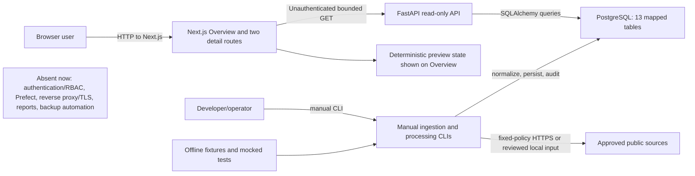
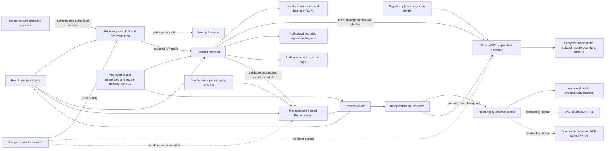
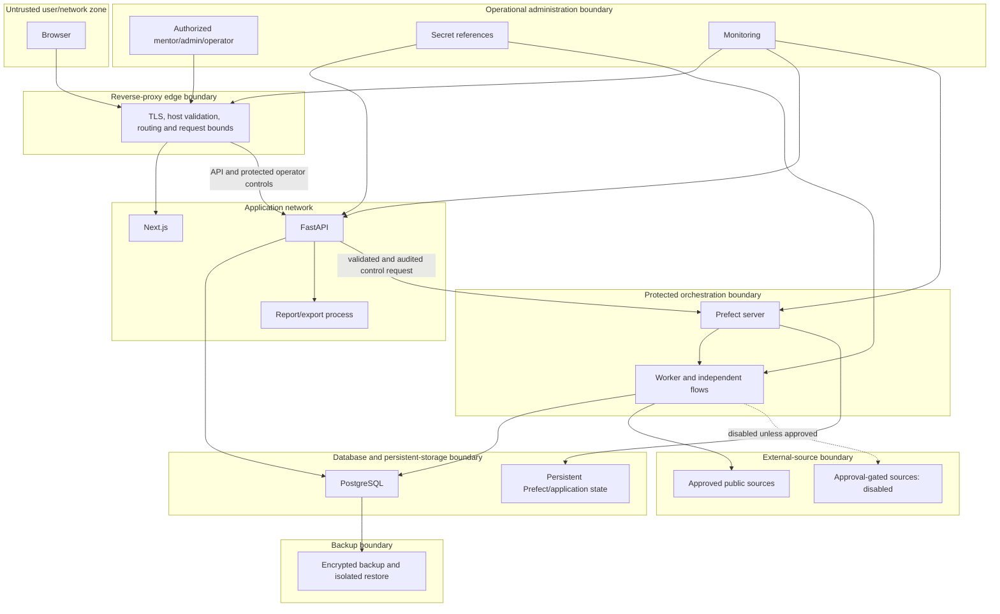

# B0-06 Production Architecture

## 1. Document control

| Field | Value |
| --- | --- |
| Task | B0-06 — Create production architecture and threat model |
| Artifact status | Architecture artifact ready for independent review; not approved or implemented |
| Prepared | 30 July 2026 |
| Branch | `dev` |
| Source checkpoint | `46e85607fce7c39d6ea33ce29bd39a0560858ef0` |
| Source commit | `46e8560 B0-05 Add mentor approval pack` |
| Formal dependency | B0-03 completed |
| Companion artifacts | `docs/b0-06-data-flow-model.md`, `docs/b0-06-threat-model.md`, `docs/b0-06-architecture-decisions.md` |

## 2. Task, dependency and checkpoint

The mandatory gate passed before repository inspection: branch `dev`, clean
working tree, successful `git fetch origin`, and identical local and remote
checkpoint `46e85607fce7c39d6ea33ce29bd39a0560858ef0`. B0-03 is the formal
dependency. B0-04 supplies the active P9 mapping and B0-05 supplies the pending
approval register. No implementation or approval is part of B0-06.

## 3. Purpose and scope

This document separates the implemented checkpoint architecture from the
required Phase B staging design. It records components, trust boundaries,
exposure, secure defaults, gaps and decision dependencies. State labels mean:

- **Implemented now:** directly supported by checkpoint code or configuration.
- **Required later:** required by the frozen MVP but not evidenced as operational.
- **Approval-gated / disabled:** must stay disabled until its APR record permits it.
- **Removed:** must not remain in the release surface.
- **Post-submission backlog:** excluded from the staging submission.
- **Accepted limitation:** bounded evidence limitation, not a missing security control.

## 4. Evidence sources and limitations

All mandatory governance files were read completely. Current implementation
claims were checked against FastAPI registration, route dependencies, models,
migrations, ingestion code, STIX/TAXII boundaries, frontend routes, API clients,
Dockerfiles, Compose, scripts, templates, deployment documents and relevant
tests. Required repository searches were executed with `git ls-files` and
`git grep`.

Key current evidence includes:

- FastAPI and its five routers: `backend/app/main.py:44-71`.
- GET-only exact-origin CORS and security middleware: `backend/app/main.py:52-65`.
- Bounded article and intelligence query routes: `backend/app/api/v1/routes/articles.py:50-137` and `backend/app/api/v1/routes/intelligence.py:55-152`.
- Lazy bounded SQLAlchemy engine/session configuration: `backend/app/db/session.py:16-58`.
- Thirteen registered ORM models: `backend/app/models/__init__.py:1-31`.
- Fixed source identity and host policy: `backend/app/ingestion/source_registry.py:51-130,316-555`.
- Bounded TAXII policy/client: `backend/app/ingestion/stix_taxii/policy.py:70-131` and `backend/app/ingestion/stix_taxii/taxii_client.py:364-372,418-509,523-592`.
- Current three frontend page files and visible preview state: `frontend/src/app/(dashboard)/page.tsx:1-125`, `frontend/src/components/dashboard/Sidebar.tsx:21-98`, and `frontend/src/data/dashboardPreview.ts:101-129`.
- Production services and network layout: `compose.prod.yml:15-150`.

The workbook snapshot predates Git completion of B0-02 through B0-05. It is an
evidence-timing limitation, not authority to alter Git history or approval
status. No installed Mermaid CLI was found; every Mermaid block is therefore
manually reviewed and structurally checked, not claimed as tool-rendered.

## 5. Current-state architecture

Text description: the browser uses the frontend and directly configured API
base URL. FastAPI exposes read-only public routes backed by PostgreSQL. Ingestion
is invoked through manual CLIs and fixed-policy clients, not Prefect. The
Overview visibly mixes API-backed panels with clearly labelled synthetic
operational and collection preview values. There is no implemented login,
backend RBAC, report/export service, production reverse proxy, Prefect service,
or automated backup boundary.

Current deficiencies are evidence-backed:

- no route authentication or authorization dependency is registered
  (`backend/app/main.py:67-71`; SEC-0004);
- no Prefect package, service, flow, worker or operator API was found
  (`backend/requirements.txt:1-15`, `compose.prod.yml:15-150`; SEC-0005);
- only Overview and two dynamic detail pages exist, while the sidebar exposes
  disabled Coming Soon entries (`frontend/src/components/dashboard/Sidebar.tsx:21-80`; SEC-0001/0002);
- operational and source panels import deterministic preview values
  (`frontend/src/app/(dashboard)/page.tsx:64-121`; SEC-0003);
- database, backend and migration receive the same PostgreSQL identity
  (`compose.prod.yml:21-23,61-63,132-134`; SEC-0019); and
- approval-gated UAE/commercial target integrations are not activated; all
  APR-01 through APR-15 remain `Need Approval`.

## 6. Required Phase B staging architecture

Text description: all user and operator traffic enters the approved edge.
Next.js and FastAPI are public only through that boundary. PostgreSQL, Prefect
administration, workers, secrets and backup storage remain internal. Backend
authentication and RBAC precede protected actions. Prefect executes one
non-overlapping parent cycle with isolated source flows. External calls resolve
through fixed policies, and approval-gated clients remain disabled. Persistence
commits before checkpoint movement. Reports, audit data and health are bounded
and authorized.

This is a required design, not an operational claim.

## 7. Architecture component inventory

| ID | Component | Current status | Target status | Repository evidence | Data handled | Inbound | Outbound | Authentication | Authorization | Secure default / failure | Phase B tasks |
| --- | --- | --- | --- | --- | --- | --- | --- | --- | --- | --- | --- |
| CMP-001 | Analyst/mentor browser | Implemented now for public UI | Required later as authenticated client | `frontend/src/app/layout.tsx:1-22`; `frontend/src/app/(dashboard)/layout.tsx:1-11` | Rendered OSINT, session state later | HTTPS edge | Edge routes only | Required later | Role-aware UI, never authoritative | Deny protected flows; honest unavailable state | B7-05, B8-01 |
| CMP-002 | Reverse proxy/TLS edge | Required later | Required staging entry boundary | `compose.prod.yml:15-150` has no proxy service; `docs/b0-03-production-mvp-scope.md:312-329` | Requests, response metadata, correlation ID | Browser/operator | Frontend/backend only | Host/TLS client boundary | Route and rate policy | Reject invalid host, scheme, size or route | B9-02 |
| CMP-003 | Next.js frontend | Implemented now | Required later hardened 12-page UI | `frontend/src/app/(dashboard)/page.tsx:1-125`; three tracked page files | Allow-listed API data, safe links | Edge/browser | FastAPI through configured base | Required later | Navigation hints only; backend decides | No mock fallback; explicit states | B8-01 through B8-07 |
| CMP-004 | FastAPI backend | Implemented now, GET-only and unauthenticated | Required later protected API and control plane | `backend/app/main.py:44-96`; route files | Queries, safe DTOs, control requests later | Edge/frontend/worker later | DB, reports, audit, policy clients | Required later | Backend RBAC required | Sanitized deny/failure; bounded inputs | B7-02, B7-03, B8-07 |
| CMP-005 | Local identity and RBAC | Absent | Required later | No auth dependency at `backend/app/main.py:67-71`; `docs/b0-03-production-mvp-scope.md:162-184` | Users, roles, sessions | Login/admin requests | Authorization decisions | Mandatory | Viewer, Analyst, Ingestion Operator, Administrator | Missing/invalid role denies | B7-01 through B7-06 |
| CMP-006 | PostgreSQL application database | Implemented now | Retained with least privilege and retention | `backend/app/models/__init__.py:1-31`; `compose.prod.yml:16-35` | Intelligence, provenance, runs, checkpoints | Backend/worker/migration | Queries, backup | Service identity | DB grants and application RBAC | Transaction failure is non-success | B1-02 through B1-06, B9-03 |
| CMP-007 | Migration job/identity | Job implemented; identity reused | Required separate migration owner | `compose.prod.yml:114-141` | Schema and migration metadata | Authorized operator | PostgreSQL DDL | Service/operator | Migration-only | Manual one-shot; stop on error | B9-01 |
| CMP-008 | Application DB identity | Privileged identity reused | Required least-privilege role | `compose.prod.yml:59-63`; SEC-0019 | Application rows | Backend/worker | PostgreSQL DML | Service identity | No schema/superuser rights | Deny unneeded operations | B1-05, B9-01 |
| CMP-009 | Self-hosted Prefect server | Absent | Required later, protected internal service | No implementation match; `compose.prod.yml:15-150` | Deployments, schedules, run metadata | Worker and protected FastAPI operator-control API | Worker and persistent state | Service identity required | Backend-authorized operator controls only | No public or direct normal-operator administration | B2-01 |
| CMP-010 | Prefect worker | Absent | Required later | No implementation match; `docs/b0-03-production-mvp-scope.md:186-213` | Flow parameters, source outcomes | Prefect server | Source flows, DB | Service identity | Closed deployments/parameters | Fail one flow without cascading | B2-01, B2-03, B2-04 |
| CMP-011 | Parent ingestion cycle | Absent | Required later; APR-06 gated | `docs/b0-03-production-mvp-scope.md:188-204`; `docs/b0-05-mentor-approval-pack.md:612-616` | Cycle identity and aggregate state | One approved schedule/manual rehearsal | Independent flows | Operator/service | Authorized schedule changes | No overlap; no duplicate schedule | B2-03, B2-04 |
| CMP-012 | Independent source flows | Manual CLIs exist | Required later under Prefect | Manual run behavior at `backend/app/ingestion/rss_cli.py:120-199` | Source records, errors, checkpoints | Parent/manual authorized action | Policy clients and DB | Service/operator | Per-source enable and run controls | Explicit disabled/deferred/partial/failed | B2-03 through B2-06 |
| CMP-013 | Fixed-policy client boundary | Implemented for current sources/STIX | Required for every live source | `backend/app/ingestion/source_registry.py:51-130,316-555`; `backend/app/ingestion/stix_taxii/policy.py:70-131` | Approved endpoints, bounded responses | Source flow | Exact HTTPS source | Source-specific | No arbitrary host/path/header/cookie | Reject redirects and unsafe responses | B3-01 through B3-06, B5-01 through B5-04, B6-02 through B6-08, B10-05 |
| CMP-014 | Approved public sources | Implemented for bounded manual workflows | Retained when policy permits | `backend/app/ingestion/source_registry.py:342-555` | Public OSINT metadata | Fixed clients | Responses only | Source-specific if required | Policy enablement | Failure is explicit; no startup collection | B3-01 through B3-06 |
| CMP-015 | UAE automated sources | Not implemented/activated | Approval-gated / disabled | `docs/b0-05-mentor-approval-pack.md:612-615`; APR-05 | Approved UAE evidence only | Fixed clients after approval | Bounded metadata | Per approved source | Per-source approval/policy | Disabled until individually approved | B5-01 through B5-04 |
| CMP-016 | Commercial enrichment sources | Not implemented/activated | Approval-gated / disabled | `docs/b0-05-mentor-approval-pack.md:612-613`; APR-01 through APR-04 | Licensed metadata only | Fixed clients after approval | Bounded permitted fields | Approved secret reference | Vendor/module/field/quota approval | Need Approval/Licence Required, no request | B6-01 through B6-08 |
| CMP-017 | Secret reference/delivery boundary | Environment configuration exists locally | Required approved delivery; APR-10 | `backend/app/core/config.py:26-74`; `docs/b0-05-mentor-approval-pack.md:599-624` | Reference IDs and credentials in service memory | Approved secret provider/operator | Approved services only | Strong operator/service | Least disclosure and separation | No value in Git/docs/log/UI | B1-01, B9-04 |
| CMP-018 | Report/export service | Absent | Required later | `docs/b0-02-repository-ui-audit.md:281`; `docs/b0-03-production-mvp-scope.md:153,295-310` | Authorized bounded report rows | Protected API | CSV/PDF response/storage if approved | Mandatory | Role and record scope | Reject unbounded data; neutralize formulas | B7-03, B8-06 |
| CMP-019 | Audit and sanitized logging | Request correlation and ingestion audit implemented | Required expanded actor/control audit | `backend/app/core/request_context.py:65-138`; `backend/alembic/versions/f8d739439ed0_create_initial_schema.py:95-247` | Correlation IDs, safe events, run outcomes | Services and edge | Protected audit store/log sink | Service identity | Audit access restricted | No raw request, payload, secret or exception | B7-03, B7-04, B8-06, B9-04 |
| CMP-020 | Health and monitoring | Basic backend/container health implemented | Required truthful full-stack health | `backend/app/api/v1/routes/health.py:12-23`; `compose.prod.yml:26-44,72-110` | Health state, timestamps, version | Monitors/operator | Safe status and alerts | Operator access later | Recipient/controls APR-12 | Unknown/degraded never healthy | B8-06, B9-04 |
| CMP-021 | Persistent application/orchestration storage | PostgreSQL volume implemented | Required PostgreSQL and Prefect persistence | `compose.prod.yml:24-25,143-144` | DB and orchestration state | DB/Prefect | Backup boundary | Service identity | Storage isolation | Restart preserves committed state | B9-03 |
| CMP-022 | Backup/restore boundary | Absent; named volume only | Required later; APR-11 gated | `docs/b0-03-production-mvp-scope.md:331-345` | Encrypted backup and integrity metadata | DB/Prefect stores | Protected destination/isolated restore | Operator/service | Backup owner and restore authorization | No recovery claim before restore proof | B9-05, B9-06 |
| CMP-023 | Mentor/admin operator | Manual developer operation exists | Required authorized role | `run.ps1`; `docs/b0-03-production-mvp-scope.md:168-184` | Control requests, approvals, evidence | Secure admin path | Edge and protected FastAPI operator-control API | Mandatory unique account | Administrator/operator separation | No shared/default account | B7-01 through B7-06, B2-06, B11-02 |
| CMP-024 | Deployment host/local fallback | Local/Compose paths implemented | Approval-gated staging or accepted fallback | `compose.prod.yml`; APR-07/APR-08 | Images, config, volumes, commit metadata | Authorized operator | Edge and internal networks | Host access | Deployment owner | Private until ownership/routing accepted | B9-02, B9-03 |

## 8. Trust-boundary inventory

| ID | Source zone | Destination zone | Crossing flows | Trust assumption | Required validation | Authn | Authz | Encryption | Logging | Abuse risk | Tasks |
| --- | --- | --- | --- | --- | --- | --- | --- | --- | --- | --- | --- |
| TB-001 | Untrusted browser/network | Reverse-proxy edge | DF-001, DF-002 | Input is hostile | Host, TLS, method, path, rate and size | Login/session for protected routes | Route/role policy | HTTPS | Correlation and safe outcome | Spoofing, flood, request smuggling | B9-02, B7-02 |
| TB-002 | Edge | Next.js | DF-002, DF-009 | Edge identity/config is controlled | Forwarded-host and deployment identity | Session presentation | Page/route role | Internal protected transport | Safe access event | Direct bypass, stale UI | B7-05, B8-01 |
| TB-003 | Edge/frontend | FastAPI | DF-003 through DF-010 | Client values are untrusted | Schema, bounds, content type, CSRF if cookies | Mandatory except explicit public health | Backend RBAC/ownership | HTTPS/internal protected | Actor, route template, result | BOLA/BFLA, injection, raw errors | B7-02, B7-03 |
| TB-004 | Backend/worker/migration job | PostgreSQL | DF-007/008/011/020/021/027/029 | Service may be compromised | Parameterized ORM, constraints, transaction state | Distinct service identity | Least DB grants | Protected network/TLS where applicable | Sanitized DB outcome | Privilege abuse, corruption | B1-03 through B1-06, B9-01 |
| TB-005 | Protected FastAPI operator-control API | Prefect protected service | DF-013 | Run controls and parameters are hostile until authorized | Closed schemas, deployment IDs, no overlap | Backend service identity | Backend-authorized operator actions only | Protected internal transport | Actor, action, run ID | Unauthorized runs, poisoned params | B2-01, B2-06 |
| TB-006 | Worker | External sources | DF-015 through DF-017 | Source and network are untrusted | Fixed policy, HTTPS, redirect/size/time/page/field bounds | Source-specific secret reference | Approval and enable state | HTTPS | Source/run/category, never secret | SSRF, malicious response, quota loss | B3-01 through B3-06, B5-01 through B5-04, B6-02 through B6-08, B10-05 |
| TB-007 | Secret provider/configuration governance | Approved services | DF-018, DF-034 | Delivery channel and references are explicitly approved | Reference, owner, rotation, scope | Strong operator/service | Per-service secret access | Approved secure delivery | Reference/action only | Secret disclosure/reuse | B1-01, B9-04 |
| TB-008 | Administrative operator | Reverse proxy and protected FastAPI operator-control API | DF-003 through DF-005 | Operator account may be compromised | MFA/SSO if approved, session, role, confirmation | Mandatory unique account | Admin/operator separation | HTTPS | Full safe audit | Privileged misuse/error | B7-01 through B7-06, B2-06, B11-02 |
| TB-009 | Services | Logs/monitoring/audit | DF-022, DF-023 | Events can contain attacker-controlled data | Allow-list, redaction, bounds, correlation | Service identity | Read access restricted | Protected transport/storage | Immutable safe event | Log injection/leak/fake health | B7-04, B8-06, B9-04 |
| TB-010 | Database/storage | Backup/restore zone | DF-024 through DF-026 | Backup media and restore inputs are untrusted | Encryption, integrity hash, compatibility and isolated restore | Backup identity | Backup/restore role | Encrypted transit/at rest | Backup/restore evidence | Theft, rollback, corrupt restore | B9-05, B9-06 |

## 9. Network and service exposure model

Text description: only the reverse proxy is the intended untrusted entry point.
The application and orchestration networks are separate protected zones;
PostgreSQL and Prefect administration have no public route. A normal application
operator reaches Prefect only through the reverse proxy and the protected
FastAPI operator-control API, where authentication, authorization, validation
and audit occur. No separate infrastructure-maintenance path is defined or
implied by this design. Backups leave the database boundary only in encrypted,
integrity-checked form.

Current production Compose binds frontend/backend to loopback by default and
keeps the database network internal (`compose.prod.yml:66-67,95-96,146-150`),
but it has no reverse proxy, TLS, Prefect or backup service. That local control
is not evidence of mentor-accessible staging.

## 10. Authentication and authorization architecture

Required local roles are Viewer, Analyst, Ingestion Operator and Administrator.
Authentication establishes a unique subject and bounded revocable session.
FastAPI—not navigation visibility—enforces role, object ownership/scope and
function permission before protected reads or mutations. Missing/invalid role
data denies. Reports, audit history, source configuration and operator actions
receive separate permission checks. Cookie sessions require CSRF protection;
token designs must prevent browser storage/log exposure. SSO is optional and
remains APR-14-gated, while secure local RBAC is mandatory.

Current state has no login, session, role or authorization dependency. Existing
routes are GET-only and bounded, which reduces current mutation exposure but is
not an acceptable release authorization boundary.

## 11. Ingestion and orchestration architecture

The target has one self-hosted Prefect parent deployment every two hours in the
APR-06-approved timezone. One schedule exists, parent cycles do not overlap,
and each enabled source is independently observable. Manual run, retry, pause,
enable and disable pass through backend authorization and audit. Flow parameters
are closed and source identities are server selected. Retries/backoff, quota,
rate limits and failure isolation are bounded. States include `success`,
`no_change`, `deferred_quota`, `disabled`, `credentials_missing`,
`licence_required`, `rate_limited`, `partial`, `failed` and `cancelled`.

Current code provides manual CLIs and persisted run/error records. For example,
the RSS CLI records explicit success/partial/failure and commits before returning
(`backend/app/ingestion/rss_cli.py:120-199`), but no Prefect orchestration or
authorized operator surface exists.

## 12. Database and transaction architecture

PostgreSQL remains the system of record. The validated current metadata has 13
tables and one Alembic head, `c4e8b2a91d30`. Target identities separate database
initialization/migration from application DML. The application identity cannot
create schemas, elevate role or perform superuser operations. Transactions are
explicit and caller-owned at service boundaries. Persistence, provenance and
audit evidence commit before checkpoint advancement; failure/partial results
cannot be reported as full success. Uniqueness, deterministic identities,
constraints, query-critical indexes, stale-update rules and retention preserve
integrity.

Current positive controls include named constraints and unique indexes in the
migrations, bounded pooling (`backend/app/db/session.py:21-31`) and distrustful
STIX persistence (`backend/app/ingestion/stix_taxii/import_service.py:1,86-187`).
The current role reuse (SEC-0019) and swallowed Anomali/Censys rollback cleanup
exceptions (`backend/app/ingestion/services/anomali_publications_ingestion_service.py:549-560`;
`backend/app/ingestion/services/censys_publications_ingestion_service.py:553-564`)
remain unresolved gaps.

## 13. External-source architecture

Every source request starts from a developer-controlled identity and exact HTTPS
host/path policy. Clients reject arbitrary base URLs, credentials in URLs,
unexpected ports, queries/fragments in configured roots, unapproved redirects,
headers, cookies and environment proxy influence. Connect/read/write/pool/total
timeouts, response bytes, pages, objects, fields, rates and quotas are bounded.
Parsing and normalization precede persistence, and source provenance survives to
API, UI and report. Raw vendor payloads and unsafe errors do not cross public
boundaries.

Current registry/base URL validation is at
`backend/app/ingestion/source_registry.py:316-339`; TAXII defaults bound JSON
and transport at `backend/app/ingestion/stix_taxii/policy.py:70-117`; the client
disables redirects/environment trust and clears cookies at
`backend/app/ingestion/stix_taxii/taxii_client.py:364-372,523-592`. These are current controls, not
approval for new live sources.

## 14. Secrets and configuration architecture

Secret values enter only approved backend/worker/database services through the
APR-10-approved delivery mechanism. Git, images, documentation, approval
records, browser variables, URLs, logs, audit rows, reports and evidence contain
only reference identifiers or configured-state booleans. Ownership, rotation,
revocation and incident response are service-specific. Missing credentials are
a non-request configuration state.

Current Pydantic settings use `SecretStr` and hide inputs in errors
(`backend/app/core/config.py:26-74`), but production Compose still passes values
as environment variables and has no approved staging secret provider.

## 15. Reporting, audit and logging architecture

Reports are generated server-side only after authorization and are bounded by
row/byte/time/field limits. CSV cells neutralize formula prefixes; filenames are
safe; PDF/CSV output excludes secrets, raw payloads, unauthorized audit data and
unsupported claims. Current report/export functionality is absent.

Request logging currently uses server-generated correlation IDs, route templates
and safe categories while disabling raw Uvicorn access targets
(`backend/app/core/request_context.py:65-138` and
`backend/app/core/logging_config.py:34-70`). Target audit events add actor,
authorized action, target reference and result without raw request bodies or
sensitive paths. Partial/deferred/failed states remain visible.

## 16. Deployment, persistence and recovery architecture

The staging submission uses hardened production images and Docker Compose, not
development runners. Kubernetes is post-submission backlog. The approved edge
provides TLS and host validation; internal services remain private. PostgreSQL
and required Prefect state persist across controlled restart. Health checks are
bounded and truthfully distinguish healthy, degraded, unhealthy, stale,
disabled and unknown. Backup is encrypted, hashed, access-controlled and
restored in isolation against compatible migrations, representative counts and
least-privilege permissions before recovery is claimed.

Production Compose currently provides non-root application images, dropped
capabilities, no-new-privileges, bounded local logging, health checks and an
internal database network (`compose.prod.yml:3-13,34-44,72-84,101-112,146-150`).
It lacks proxy/TLS, Prefect, backup/restore and the separate application DB role.

## 17. Current-to-target gap matrix

| ID | Current evidence | Target requirement | Risk | Task | Approval dependency | Release consequence | Expected closure evidence |
| --- | --- | --- | --- | --- | --- | --- | --- |
| GAP-001 | Only three page files; `frontend/src/components/dashboard/Sidebar.tsx:21-28` | Exact 12 functional top-level pages | SEC-0001 | B8-01 | None | Block release | Route/sidebar inventory, tests and browser evidence |
| GAP-002 | Coming Soon items and read-only search at `frontend/src/components/dashboard/Sidebar.tsx:21-80`; `frontend/src/components/dashboard/TopHeader.tsx:38-58` | No dead/nonfunctional release controls | SEC-0002 | B8-01 | None | Block release | UI crawl and interaction evidence |
| GAP-003 | Preview imports at `frontend/src/app/(dashboard)/page.tsx:8,64-121` | API/PostgreSQL truth or honest state | SEC-0003 | B8-01 | None | Block release | Import search, network/DB reconciliation, browser states |
| GAP-004 | No auth dependency at `backend/app/main.py:67-71` | Unique local users and backend RBAC | SEC-0004 | B7-01 through B7-06 | APR-13; APR-14 for SSO only | Block release | Auth/session/RBAC matrix and direct-request negatives |
| GAP-005 | No Prefect match/service | Protected self-hosted Prefect, one cycle and controls | SEC-0005 | B2-01 through B2-06 | APR-06 | Block scheduled release gate | Deployment, run, no-overlap and audit evidence |
| GAP-006 | `backend/requirements.txt:13` APScheduler unused | Prefect is sole scheduler | SEC-0006 | B2-01 | None | Follow-up unless architecture drift becomes active | Dependency/import inventory |
| GAP-007 | Default FastAPI docs enabled by `backend/app/main.py:44-50` | Explicit staging docs exposure decision | SEC-0007 | B9-01 | None | Harden or document bounded exposure | Route/config/security test |
| GAP-008 | No proxy service in `compose.prod.yml` | TLS/host-validating edge and private internals | SEC-0008 | B9-02 | APR-08 | Block untrusted/public access | Proxy config, TLS/host negative tests |
| GAP-009 | No report/export route or service | Authorized bounded CSV/PDF | SEC-0010 | B8-06, B7-03 | None | Block Reports page acceptance | RBAC, bound, formula and content tests |
| GAP-010 | Same DB credentials at `compose.prod.yml:21-23,61-63,132-134` | Separate least-privilege identities | SEC-0019 | B9-01, B1-05 | APR-09 | Block release | Sanitized grants and denied DDL/superuser tests |
| GAP-011 | Rollback exceptions suppressed in two services | Observable sanitized rollback failure | SEC-0020 | B1-06 | None | Block release as approved Must Fix | Injected failure tests and logs |
| GAP-012 | Production image installs shared requirements including pytest | Remove/review test dependencies | SEC-0021 | B9-01 | None | Non-blocking follow-up unless risk escalates | SBOM/image inventory and disposition |
| GAP-013 | Named DB volume only | Encrypted backup plus isolated restore | Recovery gate | B9-05, B9-06 | APR-11 | Block release | Hash, restore, counts, compatibility, RPO/RTO |
| GAP-014 | Basic backend/container checks only | Truthful full-stack health and monitoring | Operations gate | B8-06, B9-04 | APR-12 | Block health/operations acceptance | Fault injection, alert/redaction and browser evidence |
| GAP-015 | Environment-based secrets; no approved provider | Reference-only secure delivery and rotation | Secret gate | B1-01, B9-04 | APR-10 | Disable credential services; block required auth staging | Delivery design, rotation/revocation and secret scan |
| GAP-016 | Local/loopback Compose only | Mentor-accessible owned staging or accepted fallback | Deployment gate | B9-03 | APR-07 | Block release without explicit accepted path | Host/owner/access and mentor-path evidence |
| GAP-017 | No authorised users or SSO decision | Unique users, accepted local RBAC; optional SSO | Identity gate | B7-01 | APR-13, APR-14 | Block access until users/roles accepted | User-role inventory and authorization matrix |
| GAP-018 | All APR statuses `Need Approval` | Record attributable decisions or keep safe fallbacks | Governance gate | B0-05 | APR-01 through APR-15 | Disable gated components; APR-15 always blocks release | Dated approval register and immutable evidence references |

## 18. Approval-gated components

All APR-01 through APR-15 remain `Need Approval`; a fallback is not approval.
The pending register IDs are APR-01, APR-02, APR-03, APR-04, APR-05, APR-06,
APR-07, APR-08, APR-09, APR-10, APR-11, APR-12, APR-13, APR-14 and APR-15.
Commercial integrations (APR-01–04) and UAE automation (APR-05) remain disabled.
The two-hour production schedule awaits APR-06. Hosting, TLS, PostgreSQL hosting
and secret delivery depend on APR-07 through APR-10. Backup and monitoring depend
on APR-11/12. Staging users and SSO depend on APR-13/14. APR-15 blocks final
release. APR-07, APR-09 and APR-13 require an approved decision or explicit
mentor acceptance of the documented controlled fallback.

## 19. Removed and backlog components

- Remove production-visible synthetic state, Coming Soon navigation, dead search
  and unused APScheduler before release under their assigned tasks.
- Do not add a second scheduler, separate Threat Entities page, unrestricted
  endpoint editor, malware handling, scanning, exploit functionality or raw
  vendor-payload surface.
- Kubernetes, advanced graphing, product Slack/Teams/email alerts and optional
  advanced SSO are post-submission backlog unless separately approved and scoped.

## 20. Security invariants

| ID | Invariant | Components | Flows | Threats | ADR | Tasks | Required validation |
| --- | --- | --- | --- | --- | --- | --- | --- |
| INV-001 | No protected operation without backend authentication and authorization. | CMP-004/005/023 | DF-003–DF-005, DF-013, DF-014, DF-031 | THR-001–004, THR-022 | ADR-005 | B7-01 through B7-06, B2-06 | Direct-request RBAC/BOLA/BFLA/session tests |
| INV-002 | No outbound request outside an approved fixed source policy. | CMP-012–016 | DF-015–DF-017, DF-034 | THR-012–015 | ADR-004/006 | B3-01 through B3-06, B5-01 through B5-04, B6-02 through B6-08, B10-05 | Zero-transport and redirect/SSRF/bound tests |
| INV-003 | No checkpoint advancement before successful committed persistence. | CMP-006/012 | DF-020/021 | THR-019/020/023 | ADR-003 | B1-04, B2-05 | Commit-failure and checkpoint reconciliation tests |
| INV-004 | No failed or partial operation reported as full success. | CMP-011/012/019 | DF-019–DF-023 | THR-016/019/020/024/033 | ADR-009 | B1-04, B1-06, B2-04 | Injected partial/failure and counter tests |
| INV-005 | No secret value in Git, UI, reports, logs or approval documentation. | CMP-017–019 | DF-005, DF-018, DF-022, DF-023, DF-031, DF-033, DF-034 | THR-025/026/027 | ADR-007 | B1-01, B9-04, B10-07 | Secret canary scan and rotation/revocation evidence |
| INV-006 | No raw external payload or unsafe exception exposed to users. | CMP-004/013/019 | DF-016/017/022 | THR-010/013/014/025 | ADR-004/009 | B8-07, B10-05 | Schema allow-list, error/log and payload canary tests |
| INV-007 | No production-visible synthetic data presented as live. | CMP-003/018/020 | DF-009/019/022 | THR-006/028/033 | ADR-012 | B8-01, B10-06 | Import search, network/DB/browser reconciliation |
| INV-008 | No public PostgreSQL or unprotected Prefect administration. | CMP-002/006/009 | DF-011–DF-014, DF-032 | THR-017/022/030 | ADR-001/002/010 | B2-01, B9-02, B9-03 | Network exposure and unauthorized access tests |
| INV-009 | No report or export without authorization and bounded output. | CMP-004/018 | DF-010, DF-029, DF-033 | THR-027/028 | ADR-008 | B7-03, B8-06 | Role, formula, row/byte/time and content tests |
| INV-010 | No approval-gated source activated without recorded approval and required configuration. | CMP-015–017 | DF-015, DF-018, DF-034 | THR-015/025/026 | ADR-006/007 | B0-05, B2-04, B5-01 through B5-04, B6-01 through B6-08 | Approval/config reconciliation and zero-request proof |
| INV-011 | No malware handling, active scanning or exploit execution. | CMP-013–016 | DF-015–DF-017 | THR-014/015 | ADR-011 | B3-01 through B3-06, B5-01 through B5-06, B6-01 through B6-08, B10-05 | Static interface review and safe-fixture tests |
| INV-012 | No release with an open Critical/High security or integrity defect. | All release components | All release flows | THR-001–033 | ADR-009/010/012 | B10-01 through B10-08, B11-01 through B11-05 | Findings register, exact candidate, UAT and APR-15 |

## 21. Availability and failure-isolation expectations

- One source failure does not fail unrelated flows.
- Parent overlap and duplicate schedules are prevented.
- Retries/backoff are bounded and do not bypass quotas or approval state.
- Persistence failure leaves checkpoints unchanged and produces non-success.
- Health never defaults to healthy after an exception or missing check.
- Disabled, missing-credential, licence-required, deferred, partial, failed and
  cancelled states remain distinct.
- PostgreSQL and Prefect state survive controlled restart; backup/restore is
  separately verified.
- Edge, frontend, backend, orchestration and source failures have sanitized,
  correlated evidence without secrets or raw payloads.

## 22. Architecture validation evidence

Read-only validation established:

- `git ls-files` and the required `git grep` completed successfully;
- Alembic `heads` returned one head, `c4e8b2a91d30`;
- Alembic history is linear: `f8d739439ed0` → `a6c9d4e2f107` → `c4e8b2a91d30`;
- ORM metadata imported 13 tables;
- installed `docker-compose` v2.40.2 validated both Compose files with no service start;
- the `docker compose` plugin was unavailable;
- tracked frontend route inventory contains Overview plus two dynamic detail pages;
- no Prefect implementation symbol was found in application, frontend, Compose or runners; and
- the hardening validator reconciled 34 unique flows, all seven stores, 73
  referenced IDs against all 74 workbook tasks, and 148 repository evidence
  references with valid line bounds; and
- no Mermaid CLI was installed, so diagram syntax received balanced-fence and manual review only.

These checks prove structure and documentation evidence, not implemented target
controls or runtime security-test success.

## 23. Known limitations

1. B0-06 makes no implementation, deployment or approval change.
2. Target components are design requirements, not operational services.
3. All APR-01 through APR-15 decisions remain `Need Approval`.
4. No live source request, ingestion, browser runtime or security test was run.
5. The official workbook snapshot predates Git completion of B0-02 through B0-05.
6. Mermaid syntax was manually and structurally reviewed because no installed
   Mermaid rendering tool was available.
7. Compose validation used `docker-compose` because `docker compose` is unavailable;
   the Docker client also warned that the user-level config file was inaccessible.
8. Alembic/model checks were import-only and did not inspect a live PostgreSQL instance.
9. SEC-0021 remains a non-blocking image-hardening follow-up unless later evidence raises risk.
10. The existing Windows CRLF migration-hash limitation is unrelated and unchanged.

## 24. Sign-off record

| Field | Value |
| --- | --- |
| Prepared by | Pending |
| Independent reviewer | Pending |
| Architecture owner | Pending |
| Security reviewer | Pending |
| Review date | Pending |
| Decision | Pending |
| Evidence reference | Pending |

## 25. B0-06 architecture definition-of-done assessment

| Criterion | Assessment |
| --- | --- |
| Checkpoint and sources | Verified against `46e85607fce7c39d6ea33ce29bd39a0560858ef0` |
| Current/target separation | Explicit throughout and in separate diagrams |
| Component inventory | 24 stable components |
| Trust-boundary inventory | 10 stable boundaries |
| Data-flow model | 34 stable flows, DF-001 through DF-034 |
| Required diagrams | Current, target and network-zone diagrams present |
| B0-02/B0-03 coverage | Eight required findings and material release gates mapped |
| Security invariants | 12 traced to components, flows, threats, ADRs, tasks and validation |
| Approvals | All remain pending; gated components disabled by default |
| Implementation claims | None fabricated |
| Focused validation and complete-file review | Passed; no documentation defect remains identified |
| Review archive | Prepared after final validation; external path and SHA-256 reported at handoff |

This assessment records architecture-artifact readiness only. It does not make
B0-06 approved or complete, and it does not start B1-01.
