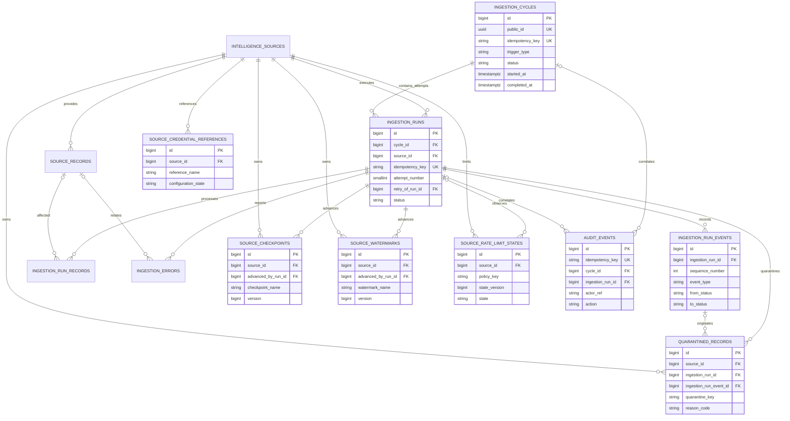
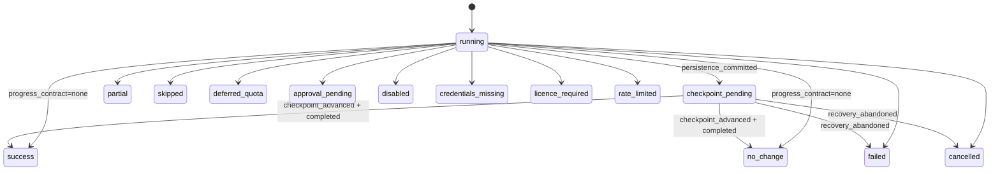

# B1-02 Operational Ingestion and Audit Schema

## 1. Purpose and scope

This design defines the normalized PostgreSQL target for ingestion control,
execution evidence, checkpoints, watermarks, rate and quota state, sanitized
failures, quarantine, audit events, and safe credential references. It is based
on repository checkpoint `4b25a5366ca02d3f94c3e75fec98f0d5dc2b6897`.

This is a design artifact only. It does not implement SQLAlchemy models,
Alembic revisions, services, Prefect flows, APIs, UI, retention jobs, database
roles, or deployment. Existing operational tables are retained and evolved;
no current table is replaced by a duplicate.

## 2. Current-state inventory

The actual ORM registration and three committed migrations expose 13 tables:

| Current table | Implemented purpose | Relevant current integrity |
| --- | --- | --- |
| `intelligence_sources` | Approved-source registry plus enabled state and legacy fetch/checkpoint fields. | Unique public ID, name, and slug; controlled source type; source deletion restricted by provenance and runs. |
| `intelligence_items` | Shared normalized intelligence record. | Named lifecycle, confidence, geographic, and UAE checks; public ID; query indexes. |
| `intelligence_item_identifiers` | Global and source-scoped identifiers. | Partial unique global/source lookups and one primary identifier per item. |
| `vulnerabilities` | One-to-one vulnerability enrichment. | Unique item FK and range/status checks. |
| `source_records` | Source provenance and bounded-payload location. | Source-scoped identity indexes, processing-state checks, and composite `(id, source_id)` key. |
| `tags`, `intelligence_item_tags` | Tags and item assignments. | Unique tag slug and composite assignment key. |
| `ingestion_runs` | One source-level ingestion attempt. | Source FK, public ID, status/trigger/timestamp/counter checks, and history indexes. |
| `ingestion_run_records` | Per-run record outcomes. | Run cascade, optional provenance links, action check, and partial run/source-record uniqueness. |
| `ingestion_errors` | Sanitized source-run failures. | Required safe message, nonnegative retry count, and run/time index. |
| `indicators` | Canonical defensive observable metadata. | Deterministic identity hash, controlled lifecycle, ranges, and lookup indexes. |
| `indicator_provenances` | Indicator attribution. | Composite source-record/source integrity and partial unique provenance identities. |
| `intelligence_item_indicators` | Publication-to-indicator evidence. | Composite key, confidence/time checks, and reverse lookup index. |

The migration chain is linear: `f8d739439ed0` creates the original ten tables,
`a6c9d4e2f107` adds indicators and provenance, and `c4e8b2a91d30` adds
publication/indicator relationships. The current code creates source-level
`ingestion_runs`, record outcomes, and sanitized `ingestion_errors`; it does not
yet model parent cycles, persistent retry lineage, append-only run events,
normalized checkpoints/watermarks, quota state, quarantine, actor audit, or
credential references. Some manual commands update
`intelligence_sources.checkpoint_value` in the same transaction as record
persistence. That is safe for their present caller-owned transaction, but the
single legacy field cannot represent multiple versioned cursor or watermark
identities.

## 3. Current-to-target mapping

| Current foundation | Target treatment |
| --- | --- |
| `intelligence_sources` | Retain as the source registry. Keep identity, policy-facing metadata, and enabled state. Add relationships to normalized operational state. Treat `checkpoint_value` and `last_successful_fetch_at` as compatibility fields until a later verified cutover; do not create a replacement source table. |
| `ingestion_runs` | Retain as the source-run and retry-attempt table. Add cycle membership, deterministic idempotency, attempt lineage, lifecycle/version fields, and expanded terminal states. Do not create `source_runs`. |
| `ingestion_run_records` | Retain as per-record execution evidence. Preserve existing history and extend action vocabulary only when B1-03 demonstrates a required mapping. |
| `ingestion_errors` | Retain as the sanitized-failure table. Add bounded failure-stage/fingerprint metadata and an upper retry bound. Do not create `failures`. |
| `intelligence_sources.checkpoint_value` | Backfill into version 1 rows in `source_checkpoints`, then maintain only under an explicit compatibility window. The normalized table becomes authoritative after B1-04/B2-05 verification. |
| `intelligence_sources.last_successful_fetch_at` | Backfill a source-level success watermark where present; later derive/update it from committed target state. |
| Existing intelligence, IOC, and provenance tables | Retain unchanged for B1-02. Operational rows reference them only where evidence needs a safe optional link. |
| Missing parent/audit state | Add the eight new tables defined below. |

## 4. Design principles

- PostgreSQL is authoritative only after a successful commit.
- One ingestion cycle evaluates sources; one `ingestion_runs` row represents
  exactly one source retry attempt within that cycle.
- Idempotency identities are deterministic, bounded, non-secret, and unique.
- Execution and actor evidence is append-only; retries add evidence rather than
  overwrite earlier attempts.
- External content is untrusted. Operational tables store allow-listed,
  sanitized, size-bounded metadata, never unrestricted raw payloads.
- Source, run, checkpoint, watermark, and quota ownership is explicit.
- Approval, licence, credential, disabled, deferred, partial, and failed states
  remain distinguishable and cannot become success by default.
- Foreign-key deletion rules preserve evidence; deletion occurs only through a
  separately approved retention workflow.
- Provider-neutral credential references are required while APR-10 is pending.

## 5. Complete target table inventory

The target contains the 13 retained current tables plus eight additive tables:

| Table | Disposition | Operational role |
| --- | --- | --- |
| `intelligence_sources` | Retain and evolve | Source-registry foundation. |
| `intelligence_items`, `intelligence_item_identifiers`, `vulnerabilities` | Retain | Intelligence identity and enrichment. |
| `source_records` | Retain | Provenance and source-record identity. |
| `tags`, `intelligence_item_tags` | Retain | Classification. |
| `indicators`, `indicator_provenances`, `intelligence_item_indicators` | Retain | IOC identity and provenance. |
| `ingestion_runs` | Retain and evolve | Source run and retry attempt. |
| `ingestion_run_records` | Retain | Per-record result evidence. |
| `ingestion_errors` | Retain and evolve | Sanitized failure evidence. |
| `ingestion_cycles` | New | Scheduled/manual runtime or migration-only legacy parent-cycle identity and aggregate state. |
| `ingestion_run_events` | New | Ordered append-only source-run lifecycle evidence. |
| `source_checkpoints` | New | Versioned opaque cursor/checkpoint history. |
| `source_watermarks` | New | Versioned time-based progress history. |
| `source_rate_limit_states` | New | Current source policy bucket, quota, backoff, and optimistic version state. |
| `quarantined_records` | New | Bounded sanitized evidence for rejected records. |
| `audit_events` | New | Append-only actor/service action evidence. |
| `source_credential_references` | New | Provider-neutral, non-secret credential-reference metadata. |

## 6. Detailed data dictionary

All timestamps are `timestamptz` in UTC. Internal IDs are `bigint identity`;
externally exposed entities use Python-generated UUIDv4 `public_id` values.

### `ingestion_cycles` (new)

| Column | Type | Null | Contract |
| --- | --- | ---: | --- |
| `id`, `public_id` | bigint identity, uuid | No | Primary and public identities. |
| `idempotency_key` | varchar(200) | No | Deterministic unique cycle identity; never a secret. |
| `trigger_type` | varchar(20) | No | `scheduled`, `manual`, or migration-only `legacy_import`; runtime creation permits only the first two. |
| `status` | varchar(30) | No | `running`, `success`, `partial`, `failed`, or `cancelled`. |
| `scheduled_for` | timestamptz | Yes | Required only for scheduled cycles; null for manual and legacy-import cycles. |
| `started_at`, `completed_at` | timestamptz | No, Yes | `running` requires null completion; terminal states require `completed_at >= started_at`. |
| `sources_expected`, `sources_started`, `sources_completed`, `sources_successful`, `sources_non_successful` | integer | No | Nonnegative cached summaries; started cannot exceed expected, completed cannot exceed started, and successful plus non-successful equals completed. |
| `safe_summary` | varchar(1000) | Yes | Sanitized human-readable outcome. |
| `created_at` | timestamptz | No | Immutable creation time. |

### `ingestion_runs` (retained source-run foundation; target extensions)

Keep every existing column. Add:

| Column | Type | Null | Contract |
| --- | --- | ---: | --- |
| `cycle_id` | bigint | No after backfill | FK to one parent cycle. |
| `idempotency_key` | varchar(240) | No after backfill | Globally unique source-attempt identity. |
| `attempt_number` | smallint | No | Zero-based attempt, bounded `0..10`. |
| `retry_of_run_id` | bigint | Yes | Self-FK to the immediately preceding attempt; required when attempt is greater than zero. |
| `state_version` | integer | No | Optimistic lifecycle version, initially 1 and positive. |
| `defer_reason` | varchar(80) | Yes | Closed safe reason for skipped/deferred terminal states. |

The target status vocabulary is `running`, nonterminal `checkpoint_pending`,
and terminal `success`, `no_change`, `skipped`, `deferred_quota`,
`approval_pending`, `disabled`, `credentials_missing`, `licence_required`,
`rate_limited`, `partial`, `failed`, and `cancelled`.
Legacy `succeeded` and `canceled` values are migrated deterministically to
`success` and `cancelled`. The existing `trigger_type` remains for compatibility
and preserves `scheduled`, `manual`, or `retry`. A runtime cycle trigger is
authoritative for how the parent was initiated; a `legacy_import` cycle states
only that the parent was synthesized during migration and leaves the original
run trigger as the truthful historical trigger.

### `ingestion_run_events` (new)

| Column | Type | Null | Contract |
| --- | --- | ---: | --- |
| `id` | bigint identity | No | Primary key; unique with `ingestion_run_id` for source-run/event correlation. |
| `ingestion_run_id` | bigint | No | FK to the source attempt. |
| `sequence_number` | integer | No | Per-run sequence `1..100000`. |
| `event_type` | varchar(60) | No | Exactly one of `acquired`, `started`, `persistence_committed`, `checkpoint_advanced`, `completed`, `skipped`, `deferred`, `partial`, `failed`, or `cancelled`. |
| `from_status`, `to_status` | varchar(30) | Yes | Validated lifecycle transition; both null only for non-transition evidence. |
| `safe_message` | varchar(1000) | Yes | Sanitized bounded detail. |
| `occurred_at`, `created_at` | timestamptz | No | Ordered event and insert times; `created_at >= occurred_at`. |

### `source_checkpoints` (new, append-only versions)

| Column | Type | Null | Contract |
| --- | --- | ---: | --- |
| `id` | bigint identity | No | Primary key. |
| `source_id` | bigint | No | Registry owner. |
| `scope_kind` | varchar(20) | No | `source` or `partition`. |
| `partition_key` | varchar(160) | Yes | Required only for partition scope; sanitized, not a credential. |
| `checkpoint_name` | varchar(80) | No | Developer-controlled cursor identity. |
| `version` | bigint | No | Positive, monotonically increasing version. |
| `checkpoint_value` | varchar(500) | No | Opaque bounded non-secret cursor. |
| `previous_checkpoint_id` | bigint | Yes | Source-matched self-FK forming one linear history. |
| `advanced_by_run_id` | bigint | No | Composite FK with `source_id` to the source-matched run responsible for advancement. |
| `persistence_committed_at`, `committed_at` | timestamptz | No | Proof order: persistence commit is not later than checkpoint commit. |

### `source_watermarks` (new, append-only versions)

| Column | Type | Null | Contract |
| --- | --- | ---: | --- |
| `id`, `source_id` | bigint identity, bigint | No | Primary key and registry owner. |
| `scope_kind` | varchar(20) | No | `source` or `partition`. |
| `partition_key` | varchar(160) | Yes | Null for source scope; non-empty and bounded for partition scope. |
| `watermark_name` | varchar(80) | No | Developer-controlled watermark identity. |
| `version` | bigint | No | Positive monotonic version within identity. |
| `watermark_value` | timestamptz | No | High-water time represented with explicit UTC semantics. |
| `previous_watermark_id` | bigint | Yes | Source-matched self-FK forming one linear history. |
| `advanced_by_run_id` | bigint | No | Composite FK with `source_id` to the source-matched run finalized by this transaction. |
| `persistence_committed_at`, `committed_at` | timestamptz | No | Commit-order evidence. |

### `source_rate_limit_states` (new, mutable current state)

| Column | Type | Null | Contract |
| --- | --- | ---: | --- |
| `id`, `source_id` | bigint identity, bigint | No | Primary key and source owner. |
| `policy_key` | varchar(80) | No | Developer-controlled quota/rate bucket identity. |
| `request_limit`, `remaining` | integer | Yes | Nonnegative; remaining cannot exceed limit when both exist. |
| `window_seconds` | integer | Yes | Positive and bounded to one year. |
| `reset_at`, `backoff_until`, `last_observed_at` | timestamptz | Yes | Safe normalized timing only. |
| `state` | varchar(30) | No | `available`, `limited`, `backoff`, `quota_unavailable`, or `unknown`. |
| `state_version` | bigint | No | Positive optimistic concurrency version. |
| `updated_by_run_id` | bigint | Yes | Composite FK with `source_id` to the source-matched run that observed the state. |
| `updated_at` | timestamptz | No | Current-state update time. |

No raw response headers, cookies, tokens, vendor payloads, or arbitrary endpoint
values belong in this table.

### `ingestion_errors` (retained sanitized-failure foundation; target extensions)

Keep all current fields. Add `failure_stage varchar(40)`, optional
`diagnostic_fingerprint char(64)`, and `safe_context varchar(1000)`. Constrain
`retry_count` to `0..10`, safe text to its declared lengths, and the fingerprint
to lowercase hexadecimal. Existing `error_type` remains the sanitized stable
category and is constrained to a safe identifier pattern during migration only
after legacy data validation.

### `quarantined_records` (new)

| Column | Type | Null | Contract |
| --- | --- | ---: | --- |
| `id`, `public_id` | bigint identity, uuid | No | Internal and review-safe identities. |
| `source_id`, `ingestion_run_id` | bigint | No | Source and attempt ownership; composite FK prevents mismatch. |
| `ingestion_run_event_id` | bigint | Yes | Optional event; composite FK with `ingestion_run_id` proves it belongs to this run. |
| `quarantine_key` | char(64) | No | Deterministic lowercase SHA-256 identity; not source content. |
| `reason_code` | varchar(80) | No | Closed sanitized reason. |
| `safe_excerpt` | varchar(1000) | Yes | Sanitized text only; never raw HTML or authorization material. |
| `safe_metadata` | varchar(2000) | Yes | Allow-listed key/value summary, not raw payload. |
| `original_byte_count`, `stored_byte_count` | integer | No | Nonnegative; stored bytes equal the PostgreSQL byte length of the two safe fields, are at most 4096, and do not exceed original bytes. |
| `status` | varchar(20) | No | `pending`, `reviewed`, `released`, or `discarded`. |
| `quarantined_at`, `reviewed_at` | timestamptz | No, Yes | Pending requires null review time; other states require `reviewed_at >= quarantined_at`. |

### `audit_events` (new, append-only)

| Column | Type | Null | Contract |
| --- | --- | ---: | --- |
| `id`, `public_id` | bigint identity, uuid | No | Internal and public-safe identities. |
| `idempotency_key` | varchar(240) | No | Unique event identity. |
| `actor_type` | varchar(30) | No | `user`, `service`, or `system`. |
| `actor_ref` | varchar(160) | No | Stable non-secret subject reference, never a session/token value. |
| `action` | varchar(80) | No | Safe identifier matching `^[a-z][a-z0-9_.-]{0,79}$`; B1-04 owns the action allow-list. |
| `target_type` | varchar(60) | No | Safe identifier matching `^[a-z][a-z0-9_.-]{0,59}$`. |
| `target_ref` | varchar(240) | No | Non-empty bounded non-secret target identity. |
| `outcome` | varchar(30) | No | `success`, `denied`, `failed`, or `no_change`. |
| `cycle_id`, `ingestion_run_id` | bigint | Yes | Optional correlation; when a run is present, cycle is required and the composite run/cycle FK proves they match. |
| `correlation_id` | varchar(100) | Yes | Server-generated safe correlation value. |
| `safe_detail` | varchar(1000) | Yes | Allow-listed detail only. |
| `occurred_at`, `created_at` | timestamptz | No | Immutable event timing; create time not before occurrence. |

### `source_credential_references` (new, provider-neutral)

| Column | Type | Null | Contract |
| --- | --- | ---: | --- |
| `id`, `source_id` | bigint identity, bigint | No | Primary key and registry owner. |
| `reference_name` | varchar(80) | No | Application alias unique per source and purpose. |
| `purpose` | varchar(60) | No | Closed non-secret use such as source authentication. |
| `external_reference_id` | varchar(240) | Yes | Trimmed non-empty opaque non-secret reference only when present; provider-neutral. |
| `configuration_state` | varchar(30) | No | `not_configured`, `configured`, `disabled`, `rotation_due`, or `revoked`. |
| `owner_ref` | varchar(160) | Yes | Non-secret accountable owner/team reference. |
| `last_rotated_at`, `expires_at` | timestamptz | Yes | Metadata only; ordered where both exist. |
| `created_at`, `updated_at` | timestamptz | No | Record lifecycle timestamps with `updated_at >= created_at`. |

The table has no secret value, password, token, key material, authorization
header, cookie, database URL, or raw delivery configuration. APR-10 remains
pending; this design neither selects nor claims approval of any provider.
`configured` and `rotation_due` require a non-null, non-empty
`external_reference_id`; `not_configured` requires it to be null. `disabled`
and `revoked` may retain a bounded reference for re-enablement or evidence, or
may be null. No state proves that referenced credentials are usable.

## 7. Mermaid ERD



## 8. Lifecycle and state definitions

- A **scheduled cycle** has `trigger_type=scheduled`, a required
  `scheduled_for`, and a deterministic key derived from the deployment and
  schedule slot. A **manual cycle** has `trigger_type=manual`, no schedule slot,
  and an authorized request idempotency key. Runtime cycle creation permits
  only `scheduled` or `manual`. `legacy_import` is migration-only, always has a
  null `scheduled_for`, and never reclassifies the retained run trigger.
- Migration creates one deterministic `legacy_import` cycle per existing run,
  preserves `ingestion_runs.trigger_type` unchanged, derives cycle times from
  the run, and invents neither a schedule nor retry ancestry. Every legacy cycle
  has `sources_expected=1` and `sources_started=1`. A `running` run maps to a
  running cycle with `sources_completed=0`, both outcome counters zero, and
  null `completed_at`. A terminal run maps `succeeded -> success`,
  `partial -> partial`, `failed -> failed`, and `canceled -> cancelled`, with
  `sources_completed=1`; success uses `sources_successful=1` and
  `sources_non_successful=0`, while every other terminal mapping uses the
  inverse. Terminal cycle `completed_at` is copied from the run and migration
  fails closed if it is absent or invalid. One cycle per run intentionally does
  not reconstruct unknown historical parent grouping; it is honest standalone
  migration evidence.
- A **source run** is one source attempt within one cycle. Attempt zero is the
  first execution. A **retry attempt** is a new row with the same cycle/source,
  the next attempt number, and `retry_of_run_id` pointing to the prior attempt.
- A **skipped run** is terminal `skipped`: evaluation occurred, but policy found
  no request or processing work. A **deferred run** is terminal with the precise
  reason `deferred_quota`, `approval_pending`, `credentials_missing`,
  `licence_required`, or `rate_limited`; it performs no prohibited transport.
- A **disabled source** yields a terminal `disabled` run so every evaluated
  source is visible. An **approval-pending run** uses `approval_pending`; it is
  not a failure and cannot imply approval.
- `checkpoint_pending` is nonterminal. It means record persistence committed
  but a required checkpoint/watermark advancement has not committed. The normal
  progress sequence is `running -> checkpoint_pending -> success` or
  `running -> checkpoint_pending -> no_change`.
- `no_change` means a valid completed request/evaluation produced no durable
  data change and any required progress-state transaction committed. `partial`
  means some intended work completed and some did not. `failed` means required
  work did not complete safely. `cancelled` records an acknowledged stop. Only
  `success` means all intended work and required progress evidence committed.
- Failed, partial, disabled, approval-pending, credential-missing,
  licence-required, rate-limited, deferred, skipped, and cancelled runs do not
  advance progress and may become terminal directly from `running`.
- Direct `running -> success|no_change` is permitted only when the fixed,
  developer-controlled source policy declared `progress_contract=none` before
  run acquisition. Missing/null progress values do not imply that policy. The
  direct-completion transaction commits persistence, counters,
  `persistence_committed`, terminal status/time, and `completed` evidence
  atomically.
- Cycles start at `running` and end once. A cycle is `success` only when every
  required source result satisfies the cycle policy; any source `partial` or
  `failed` prevents full success. Disabled/deferred states are aggregated
  truthfully according to policy, never silently converted. A
  `checkpoint_pending` run is started but not completed, so its cycle remains
  `running` and does not increment `sources_completed`.
- Valid transitions are enforced by B1-04 services and append-only run events:
  creation to `running` or a terminal non-request state; `running` to
  `checkpoint_pending` when progress must advance; `checkpoint_pending` to
  `success` or `no_change`; or a separately committed
  `checkpoint_pending -> failed|cancelled` only after recovery is abandoned.
  No terminal state transitions again. Database checks constrain values and
  status/time shape; transition tests enforce cross-row history.



## 9. Keys, foreign keys and deletion rules

- Sources use `RESTRICT` for runs, checkpoints, watermarks, rate states,
  quarantine, and credential references. Disable or archive a source instead
  of deleting its evidence.
- Cycles use `RESTRICT` while runs exist. Run deletion is allowed only by an
  approved retention job after dependent run events, records, and errors are
  archived/deleted together.
- Run events use `ON DELETE CASCADE` solely for approved whole-run retention and
  are otherwise append-only. Checkpoints and watermarks use `RESTRICT` to keep
  the run that advanced them.
- `ingestion_runs` exposes unique `(id, source_id)` and `(id, cycle_id)` pairs.
  Run events expose unique `(id, ingestion_run_id)`.
- Checkpoint/watermark `advanced_by_run_id` and rate-state `updated_by_run_id`
  use `(run_id, source_id)` composite FKs to make cross-source correlation
  impossible. Previous checkpoint/watermark links likewise combine previous ID
  with `source_id`; each state table exposes unique `(id, source_id)`.
- Quarantine uses `(ingestion_run_id, source_id)` to prove same-source
  ownership. Its optional `(ingestion_run_event_id, ingestion_run_id)` FK proves
  the event belongs to that run.
- Audit events with an `ingestion_run_id` must also have `cycle_id`; composite
  `(ingestion_run_id, cycle_id)` references unique `(ingestion_runs.id,
  ingestion_runs.cycle_id)`. This prevents a run from being correlated with an
  unrelated cycle. Composite audit deletion uses `SET NULL`; stable bounded
  target references preserve meaning after retention.
- Advancement, predecessor, rate-state updater, quarantine run/event, and retry
  composite FKs use `ON DELETE RESTRICT`. The retention workflow must remove or
  archive dependent current/quarantine evidence explicitly before whole-run
  deletion; it cannot silently break correlation.
- Retry self-FKs use `RESTRICT`; source-matched previous
  checkpoint/watermark links use `RESTRICT` and are unique so history cannot
  fork silently. Audit-event deletion never cascades from an operational object.

## 10. Named uniqueness and check constraints

Required names and row-local contracts for B1-03 are:

- Cycles: `uq_ingestion_cycles_idempotency_key`,
  `ck_ingestion_cycles_trigger_type_allowed`,
  `ck_ingestion_cycles_trigger_schedule_consistency`,
  `ck_ingestion_cycles_status_allowed`,
  `ck_ingestion_cycles_status_time_consistency`,
  `ck_ingestion_cycles_completed_at_order`,
  `ck_ingestion_cycles_counters_non_negative`, and
  `ck_ingestion_cycles_counter_relationships`. The last check enforces
  `sources_started <= sources_expected`,
  `sources_completed <= sources_started`, and
  `sources_successful + sources_non_successful = sources_completed`.
- Runs: `uq_ingestion_runs_idempotency_key`,
  `uq_ingestion_runs_source_cycle_attempt`,
  `uq_ingestion_runs_id_source_id`, `uq_ingestion_runs_id_cycle_id`,
  `fk_ingestion_runs_retry_source`, `fk_ingestion_runs_retry_cycle`,
  `ck_ingestion_runs_attempt_number_bounded`,
  `ck_ingestion_runs_retry_lineage_consistency`,
  `ck_ingestion_runs_status_allowed`, and
  `ck_ingestion_runs_status_time_consistency`, plus retained timestamp/counter
  checks. The status/time check requires null `completed_at` for `running` and
  `checkpoint_pending`, and non-null `completed_at >= started_at` for every
  terminal status.
- Run events: `uq_ingestion_run_events_run_sequence`,
  `uq_ingestion_run_events_id_run_id`,
  `ck_ingestion_run_events_sequence_bounded`,
  `ck_ingestion_run_events_event_type_allowed`,
  `ck_ingestion_run_events_transition_shape`, and
  `ck_ingestion_run_events_created_at_order`. The event-type check uses exactly
  the ten values in the data dictionary.
- Checkpoints: partial unique indexes
  `uq_source_checkpoints_source_identity_version` on
  `(source_id, checkpoint_name, version) WHERE scope_kind = 'source' AND
  partition_key IS NULL` and
  `uq_source_checkpoints_partition_identity_version` on
  `(source_id, partition_key, checkpoint_name, version) WHERE scope_kind =
  'partition' AND partition_key IS NOT NULL`; plus
  `uq_source_checkpoints_id_source_id`, `uq_source_checkpoints_previous`,
  `fk_source_checkpoints_advanced_run_source`,
  `fk_source_checkpoints_previous_source`,
  `ck_source_checkpoints_scope_identity`,
  `ck_source_checkpoints_version_positive`, and
  `ck_source_checkpoints_commit_order`.
- Watermarks: partial unique indexes
  `uq_source_watermarks_source_identity_version` on
  `(source_id, watermark_name, version) WHERE scope_kind = 'source' AND
  partition_key IS NULL` and
  `uq_source_watermarks_partition_identity_version` on
  `(source_id, partition_key, watermark_name, version) WHERE scope_kind =
  'partition' AND partition_key IS NOT NULL`; plus
  `uq_source_watermarks_id_source_id`, `uq_source_watermarks_previous`,
  `fk_source_watermarks_advanced_run_source`,
  `fk_source_watermarks_previous_source`,
  `ck_source_watermarks_scope_identity`,
  `ck_source_watermarks_version_positive`, and
  `ck_source_watermarks_commit_order`.
- Rate state: `uq_source_rate_limit_states_source_policy`,
  `fk_source_rate_limit_states_run_source`,
  `ck_source_rate_limit_states_counts_valid`,
  `ck_source_rate_limit_states_window_bounded`, and
  `ck_source_rate_limit_states_version_positive`.
- Errors: `ck_ingestion_errors_retry_count_bounded` and
  `ck_ingestion_errors_diagnostic_fingerprint_format`.
- Quarantine: `uq_quarantined_records_run_key`,
  `fk_quarantined_records_run_source`,
  `fk_quarantined_records_event_run`,
  `ck_quarantined_records_key_format`,
  `ck_quarantined_records_sizes_bounded`,
  `ck_quarantined_records_status_allowed`, and
  `ck_quarantined_records_reviewed_at_consistency`.
  `ck_quarantined_records_sizes_bounded` requires both counts nonnegative and:

  ```sql
  stored_byte_count =
    octet_length(coalesce(safe_excerpt, '')) +
    octet_length(coalesce(safe_metadata, ''))
  AND stored_byte_count <= 4096
  AND stored_byte_count <= original_byte_count
  ```

- Audit: `uq_audit_events_idempotency_key`,
  `fk_audit_events_run_cycle`, `ck_audit_events_run_cycle_consistency`,
  `ck_audit_events_actor_type_allowed`, `ck_audit_events_action_format`,
  `ck_audit_events_target_type_format`,
  `ck_audit_events_target_ref_length`, `ck_audit_events_outcome_allowed`, and
  `ck_audit_events_created_at_order`.
- Credential references:
  `uq_source_credential_references_source_name_purpose`,
  `ck_source_credential_references_state_allowed`,
  `ck_source_credential_references_configured_shape`,
  `ck_source_credential_references_rotation_expiry_order`, and
  `ck_source_credential_references_updated_at_order`. The configured-shape
  check implements the exact null/non-empty rules in the data dictionary.

PostgreSQL ordinary unique constraints treat nulls as distinct. Therefore no
ordinary unique constraint containing nullable `partition_key` defines progress
identity. The four scope-specific partial unique indexes above separately
enforce source and partition identities. The scope checks enforce source scope
with null `partition_key`, and partition scope with non-null, non-empty
`partition_key` (`char_length(btrim(partition_key)) BETWEEN 1 AND 160`). The
partial unique indexes also support latest-version queries through equality on
their identity prefix and a backward B-tree scan on `version`; a separate
latest-version index is unnecessary unless B1-05 query-plan evidence requires
one. Monotonicity against the previous row is a B1-04 locked-service invariant
because a row-local check cannot compare rows safely.

## 11. Query-driven index plan

| Query | Index |
| --- | --- |
| Cycle history by status/time | `(status, started_at DESC, id DESC)` |
| Cycle idempotency acquisition | Unique `idempotency_key` |
| Source runs for a cycle | `(cycle_id, source_id, attempt_number)` unique |
| Latest source runs | `(source_id, started_at DESC, id DESC)`; retain current index and add ID tie-breaker if query evidence requires it. |
| Ordered run event page | `(ingestion_run_id, sequence_number)` unique |
| Current source-scope checkpoint/watermark version | The matching source-scope partial unique index supports identity equality and backward scan by version. |
| Current partition-scope checkpoint/watermark version | The matching partition-scope partial unique index supports identity equality and backward scan by version. |
| Rate/quota readiness | Unique `(source_id, policy_key)` plus partial `(state, backoff_until)` for non-available rows. |
| Failure history | Retain `(ingestion_run_id, occurred_at DESC)`; add `(error_type, occurred_at DESC)` only for the approved Run History query. |
| Quarantine review queue | `(status, quarantined_at, id)` and unique run/key. |
| Audit search | `(occurred_at DESC, id DESC)`, `(actor_ref, occurred_at DESC)`, `(action, occurred_at DESC)`, and correlation partial index. |
| Credential configuration state | Unique `(source_id, reference_name, purpose)` and `(configuration_state, source_id)`. |

Indexes are not added speculatively. B1-03 validates DDL; B1-05 validates
representative PostgreSQL query plans and may adjust non-unique indexes without
changing these integrity identities.

## 12. Transaction boundaries

- **Cycle creation:** acquire one deterministic cycle idempotency key and insert
  its initial audit event atomically.
- **Source-run acquisition:** lock/acquire the source/cycle/attempt identity,
  insert the run and its first event, and reject duplicates atomically.
- **Record persistence:** one caller-owned outer transaction contains normalized
  records, provenance, run-record evidence, sanitized errors/quarantine, and
  reconciled record counters. When progress advancement is required, it also
  sets the run to nonterminal `checkpoint_pending` and inserts a
  `persistence_committed` event atomically. It must not set `success`,
  `no_change`, or `completed_at`. Per-record savepoints may isolate safe
  failures but never own the outer commit.
- **Counters and final status:** detailed evidence determines counters. For a
  source whose fixed policy is `progress_contract=none`, the persistence
  transaction may also set terminal `success`/`no_change`, set `completed_at`,
  and insert `persistence_committed` plus `completed` events atomically. Other
  direct terminal outcomes never advance progress.
- **Event insertion:** reserve the next bounded sequence while holding the run
  lock; events are never updated or reused.
- **Checkpoint/watermark advancement:** occurs in a new transaction only after
  the persistence transaction reports a durable commit. It locks and validates
  the `checkpoint_pending` run, verifies its source and current progress
  version, inserts the deterministic next checkpoint/watermark version, inserts
  `checkpoint_advanced`, sets the run to `success` or `no_change`, sets
  `completed_at`, and inserts `completed`, all atomically.
- **Quarantine insertion:** occurs with the run attempt that rejected the record
  or in a separately auditable recovery transaction if persistence itself
  rolled back; never claim a quarantined row that did not commit.
- **Audit insertion:** protected control actions insert an audit event in the
  same transaction as the action where possible. If the controlled action is
  external, use a deterministic event key and explicit attempted/outcome events
  so retry cannot duplicate or erase evidence.

## 13. Checkpoint-after-commit contract

No checkpoint or watermark advances before successful committed persistence.
The persistence transaction commits normalized data, provenance, record
outcomes, sanitized errors/quarantine, reconciled counters,
`checkpoint_pending`, and `persistence_committed` evidence first. It never
commits terminal `success`/`no_change` before required progress advancement.
Only after that commit may B2-05 open the atomic advancement/finalization
transaction described above.

If advancement commit fails, the prior progress state remains authoritative and
the run remains `checkpoint_pending`; no `checkpoint_advanced`, terminal event,
terminal status, or `completed_at` is committed. Recovery safely retries with
the same deterministic progress identity and validates the same prior version.
Only when recovery is explicitly abandoned may a separate transaction move the
run from `checkpoint_pending` to `failed` or `cancelled`, set `completed_at`, and
append the matching terminal event. The system never reports success for a
failed or uncertain advancement. `persistence_committed_at <= committed_at`,
source-matched FKs, prior-row/version checks, and append-only events provide
evidence; they do not replace injected commit-failure tests.

## 14. Retry and idempotency behavior

- Repeating the same cycle request returns/acquires the existing cycle by its
  unique key; it does not create a second parent cycle.
- Repeating the same source attempt returns/acquires the existing run by its
  unique key and `(source_id, cycle_id, attempt_number)` identity.
- Repeating checkpoint/watermark finalization uses the same deterministic
  identity/version expectation. It either observes the already-committed result
  or inserts it once; it cannot create a second version or duplicate terminal
  evidence.
- A retry is always a new `ingestion_runs` row with the next bounded attempt and
  an explicit link to the prior attempt. Earlier run records, errors, events,
  counters, checkpoints, and quarantine remain unchanged.
- Existing source-record and identifier uniqueness continues to prevent
  duplicate intelligence. `content_hash` and source-native identity determine
  created/updated/no-change results.
- Locking, stale-write detection, linear retry ancestry, monotonic version
  enforcement, and concurrency recovery belong to B1-04.

## 15. Rate-limit and quota state

Rate/quota observations are normalized into one current row per source and
developer-controlled policy bucket. Unknown values remain null, not zero.
`rate_limited`, `deferred_quota`, `quota_unavailable`, and backoff are distinct.
Only normalized counts and times are stored; raw vendor headers and responses
are prohibited. State updates use `state_version` compare-and-swap under B1-04.
Retries respect `backoff_until` and never bypass approval, credential, licence,
quota, or fixed-source policy gates.

## 16. Quarantine safety

Quarantine is not a raw-payload archive. It stores a deterministic hash, closed
reason, bounded sanitized excerpt/metadata, byte counts, and review state. It
must exclude HTML, binaries, malware, credentials, headers, cookies, stack
traces, unrestricted JSON, and source response bodies. Application validation
enforces a 4096-byte combined stored limit before insertion. The database
independently requires `stored_byte_count` to equal the sum of PostgreSQL
`octet_length` for the coalesced safe fields, be no greater than 4096 or
`original_byte_count`, and keep both counts nonnegative. Release/discard review
is authorized, audited, and never mutates original run evidence.

## 17. Audit-event safety

Audit events are append-only and allow-list actor type, action, target, outcome,
correlation, and bounded safe detail. They contain no request/response body,
unsafe path/query, SQL, environment value, session identifier, credential,
authorization material, cookie, or raw exception. The application role receives
INSERT/SELECT but no UPDATE/DELETE privilege; retention uses a separate audited
owner. Corrections append a superseding event rather than changing history.

## 18. Credential-reference safety

Operational tables store no credential values. `source_credential_references`
stores only a provider-neutral alias, optional opaque non-secret reference ID,
configuration state, ownership metadata, and rotation/expiry times. A configured
boolean or state is not proof that a value is valid. Missing configuration
produces `credentials_missing` before transport. APR-10 remains `Need Approval`;
no credential provider is approved, and no secret-management provider or
delivery mechanism is approved by this design.

## 19. Retention and archival

Until APR-09 and operational owners approve exact periods, use conservative
staging retention and do not claim production policy. Sources, checkpoint and
watermark chains, run events, and audit events are preserved while referenced
by an investigation, report, approval, release, or backup. Quarantine receives
a shorter separately approved review window; expiry appends an audit event
before deletion. Raw/bounded source payload retention remains separate from
operational evidence. Retention deletes children in dependency order using a
restricted role, never cascades from source deletion, and is tested against
provenance, retry, checkpoint, and audit preservation.

## 20. Task ownership and deferred implementation

- **B1-03** owns SQLAlchemy models, registration, the additive Alembic revision,
  database constraints/indexes, and migration tests.
- **B1-04** owns transaction, lock, lifecycle-transition, optimistic version,
  monotonicity, retry, and idempotency services.
- **B2 tasks** own Prefect server/worker/deployments and runtime execution.
- **B2-05** owns checkpoint and watermark advancement after committed
  persistence and its failure/recovery tests.
- Later API/UI tasks own authorized allow-listed read exposure for Sources,
  Ingestion Operations, Run History, Audit Log, and System Health.

B1-02 implements none of those responsibilities. Database roles, actual
retention periods, Prefect IDs, APIs, and UI schemas remain deferred.

## 21. Threat and acceptance traceability

| Requirement | Design control | Source trace |
| --- | --- | --- |
| Prevent early checkpoint | Separate commit boundary, version chain, source-matched run, commit-order evidence | INV-003; DF-020/021; THR-019/020/023 |
| Preserve truthful failure/partial/defer | Closed states, ordered events, immutable attempts, reconciled counters | INV-004; THR-016/019/020/024/033 |
| Prevent duplicates/stale overwrites | Cycle/run keys, source/cycle/attempt unique, version/lock contract | ADR-003; B0-03 database gate |
| Prevent secret disclosure | Reference-only credential table; safe failure/quarantine/audit fields | INV-005/006/010; THR-025/026 |
| Preserve provenance and audit | Restrictive FKs, append-only evidence, retention holds | AST-002/009; DF-022/027 |
| Enforce safe source state | Registry foundation, rate/quota state, zero-request deferred statuses | INV-002/010; THR-012/015 |
| Isolate source failures | One run per source attempt inside a parent cycle | ADR-002; THR-024 |

## 22. Explicit limitations

1. This document does not implement or approve models, a migration, services,
   Prefect, database roles, retention jobs, APIs, UI, or deployment.
2. Cross-row lifecycle validity and monotonic versions require B1-04 locking and
   tests; row-local checks alone cannot prove them.
3. The legacy checkpoint fields remain until B1-03/B1-04/B2-05 complete a
   verified compatibility and cutover sequence.
4. Existing retry history lacks cycle/attempt lineage; migration can preserve it
   only as deterministic legacy attempt-zero evidence without inventing links.
5. Exact retention periods await APR-09; credential delivery/provider selection
   awaits APR-10. Both remain pending.
6. No live PostgreSQL migration, source request, Prefect execution, or UI/API
   validation is claimed by B1-02.
7. Mermaid is reviewed as source text; tool-rendered layout is not claimed.
8. The known Windows CRLF raw-byte migration-hash limitation remains unchanged;
   committed migrations and their expected hashes must not be edited to hide it.
