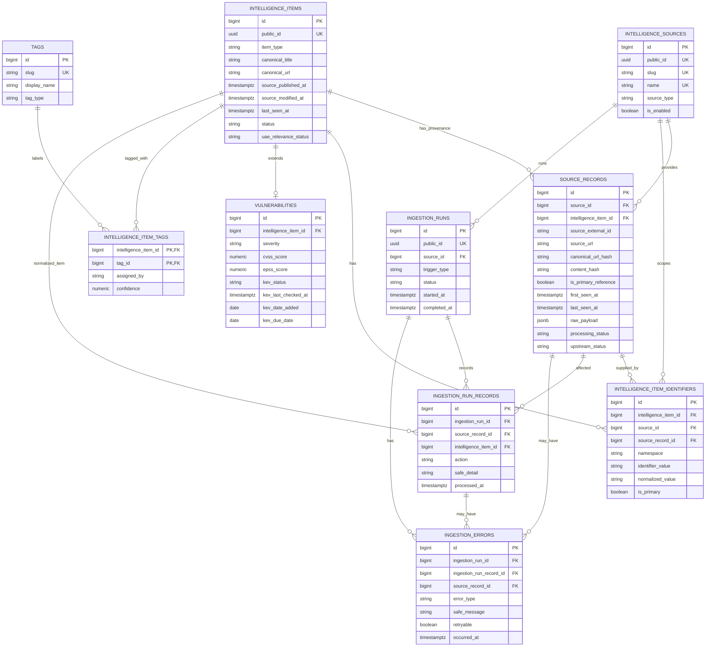

# Database Schema Design

Project: Alpha Data / Cyber OSINT Dashboard 
Task: P1-02 - Design the database schema and relationships 
Status: Approved design 
Database: PostgreSQL 17 
Planned ORM: SQLAlchemy 
Planned migration tool: Alembic 
Scope: Design documentation only; no models or migrations implemented

## 1. Purpose

The database will support the collection, normalization, storage, search, visualization, and reporting of trusted public defensive cybersecurity intelligence. It is designed for a cybersecurity OSINT dashboard that can be reviewed by senior cybersecurity staff and extended safely during later implementation tasks.

The schema must support:

- Vulnerabilities
- Security advisories
- Cybersecurity news
- Threat reports
- UAE official alerts
- Source traceability
- External identifiers
- CVSS, EPSS, and CISA KEV enrichment
- UAE/global relevance
- Tags
- Ingestion auditing
- Deduplication and idempotency

The system must not store:

- Malware binaries
- Exploit payloads
- Stolen credentials
- Phishing kits
- Persistence or evasion tooling
- Authorization headers
- API secrets
- Sensitive request data
- Full stack traces

All external titles, summaries, URLs, identifiers, remediation text, metadata, and JSON payloads are untrusted input and must be validated, bounded, and rendered safely.

## 2. Architecture Decision

The approved strategy is a shared `intelligence_items` base table with type-specific extension tables, beginning with `vulnerabilities`.

This was chosen over one large sparse intelligence table because vulnerability fields such as CVSS, EPSS, CISA KEV status, affected products, and remediation data do not naturally apply to news articles, threat reports, or UAE official alerts. A single table would grow many nullable columns and make validation less clear.

This was also chosen over completely separate unrelated tables for every intelligence type because common metadata would be duplicated across vulnerabilities, advisories, news, reports, and alerts. Shared fields such as titles, summaries, source timestamps, UAE relevance, status, identifiers, tags, and provenance should be handled consistently.

The approved approach keeps common metadata reusable while keeping vulnerability-specific fields separate. It also supports global list/search views without forcing unrelated intelligence types into identical extension fields.

## 3. Key Design Decisions

- Internal primary keys use PostgreSQL `bigint identity`.
- Public API-safe IDs use UUIDv4 generated in Python/SQLAlchemy.
- PostgreSQL extensions are not required only for UUID generation.
- `item_type` is the primary controlled classification.
- Categories are deferred because they would duplicate item-type classification.
- Tags provide flexible subjects, sectors, vendors, products, regions, techniques, and themes.
- Provenance is centralized in `source_records`.
- External identifiers use `intelligence_item_identifiers`.
- Latest CVSS, EPSS, and KEV values are stored directly on `vulnerabilities` for the MVP.
- Historical enrichment is deferred.
- All timestamps use timezone-aware UTC storage.
- Raw source JSON is bounded and stored only when permitted and useful.
- Intelligence items should normally be archived through status changes rather than hard deleted.

## 4. Approved MVP Tables

| Table | Purpose | Primary key | Important relationships |
|---|---|---|---|
| `intelligence_sources` | Registry of approved public intelligence sources and source fetch state. | `id` | Source has many source records, identifiers, and ingestion runs. |
| `intelligence_items` | Shared normalized record for vulnerabilities, advisories, news, reports, and alerts. | `id` | Item has identifiers, source records, tags, and optional vulnerability extension. |
| `intelligence_item_identifiers` | CVE, GHSA, OSV, vendor advisory, CWE, and other approved identifiers. | `id` | Identifier belongs to one item and may reference a source and source record. |
| `vulnerabilities` | Vulnerability-specific latest enrichment values. | `id` | One-to-one extension of `intelligence_items`. |
| `source_records` | Source provenance, original URLs, source IDs, raw payload, and processing state. | `id` | Source record belongs to a source and may normalize to one item. |
| `tags` | Flexible labels for subjects, sectors, vendors, products, regions, techniques, and themes. | `id` | Tags connect to items through `intelligence_item_tags`. |
| `intelligence_item_tags` | Many-to-many join between items and tags. | `(intelligence_item_id, tag_id)` | Links one item to one tag. |
| `ingestion_runs` | Source-level ingestion execution audit. | `id` | Run belongs to one source and has run records and errors. |
| `ingestion_run_records` | Detailed per-run source-record outcomes. | `id` | Links a run to source records and optionally items. |
| `ingestion_errors` | Sanitized ingestion error records. | `id` | Error belongs to a run and may reference a run record or source record. |

Important validation and security rules:

- Real secrets must never be stored in checkpoint fields, raw payloads, errors, logs, or source metadata.
- Source URLs must use `http` or `https`.
- Raw payloads must be size-limited before insertion.
- External text must be escaped in the frontend and never rendered as trusted HTML.
- Deletion should preserve provenance unless an approved retention cleanup applies.

## 5. Detailed Data Dictionary

### `intelligence_sources`

| Column | Conceptual PostgreSQL type | Nullable | Key or constraint | Purpose |
|---|---|---:|---|---|
| `id` | `bigint identity` | No | Primary key | Internal source identifier. |
| `public_id` | `uuid` | No | Unique | Public API-safe source identifier generated by Python/SQLAlchemy. |
| `name` | `varchar(160)` | No | Unique | Human-readable source name. |
| `slug` | `varchar(80)` | No | Unique | Stable source slug used by code and filters. |
| `source_type` | `varchar(40)` | No | Controlled value | Source access type such as API, RSS, CSV, or JSON. |
| `base_url` | `varchar(2048)` | Yes | URL validation in app | Official source base URL. |
| `is_enabled` | `boolean` | No | Default `true` | Whether the source is enabled for ingestion. |
| `rate_limit_notes` | `varchar(500)` | Yes | No secrets | Human-safe source usage notes. |
| `last_successful_fetch_at` | `timestamptz` | Yes | UTC | Last complete successful fetch timestamp. |
| `checkpoint_value` | `varchar(500)` | Yes | No secrets | Public cursor/date/checkpoint value. |
| `created_at` | `timestamptz` | No | UTC | Creation timestamp. |
| `updated_at` | `timestamptz` | No | UTC | Last update timestamp. |

Important rules:

- `slug` is unique.
- `public_id` is unique.
- `checkpoint_value` must never contain authentication tokens or secrets.
- Disabled sources remain stored for provenance.

Approved `source_type` values:

- `api`
- `rss`
- `csv`
- `json`

### `intelligence_items`

| Column | Conceptual PostgreSQL type | Nullable | Key or constraint | Purpose |
|---|---|---:|---|---|
| `id` | `bigint identity` | No | Primary key | Internal item identifier. |
| `public_id` | `uuid` | No | Unique | Public API-safe item identifier generated by Python/SQLAlchemy. |
| `item_type` | `varchar(40)` | No | Controlled value | Primary intelligence classification. |
| `canonical_title` | `varchar(500)` | No | Length bounded | Normalized display title. |
| `summary` | `text` | Yes | Length bounded in app | Safe summary or description. |
| `canonical_url` | `varchar(2048)` | Yes | Validated in application; not globally unique | Preferred display URL. |
| `source_published_at` | `timestamptz` | Yes | UTC | Earliest reliable publication time among linked source records. |
| `source_modified_at` | `timestamptz` | Yes | UTC | Latest reliable modification time among linked source records. |
| `collected_at` | `timestamptz` | No | UTC | First normalized collection timestamp. |
| `last_seen_at` | `timestamptz` | No | UTC | Latest observation time among linked source records. |
| `status` | `varchar(40)` | No | Controlled value | Lifecycle status. |
| `superseded_by_item_id` | `bigint` | Yes | Self-FK, `ON DELETE RESTRICT` | Item that supersedes this item. |
| `merged_into_item_id` | `bigint` | Yes | Self-FK, `ON DELETE RESTRICT` | Item this duplicate was merged into. |
| `data_confidence` | `numeric(4,3)` | Yes | 0 to 1 | Confidence in normalized record. |
| `geographic_scope` | `varchar(40)` | No | Controlled value | Global, regional, UAE, or unknown scope. |
| `uae_relevance_status` | `varchar(40)` | No | Controlled value | UAE relevance classification. |
| `uae_relevance_confidence` | `numeric(4,3)` | Yes | 0 to 1 | Confidence in UAE relevance. |
| `uae_relevance_reason` | `varchar(1000)` | Yes | No HTML | Short explanation for relevance. |
| `uae_relevance_method` | `varchar(40)` | No | Controlled value | automatic, manual, source_declared, or unassigned. |
| `analyst_review_status` | `varchar(40)` | No | Controlled value | Review state. |
| `created_at` | `timestamptz` | No | UTC | Creation timestamp. |
| `updated_at` | `timestamptz` | No | UTC | Last update timestamp. |

Approved `item_type` values:

- `vulnerability`
- `security_advisory`
- `cyber_news`
- `threat_report`
- `uae_official_alert`
- `other_defensive_intel`

Approved status values:

- `active`
- `superseded`
- `merged`
- `archived`

Approved `uae_relevance_status` values:

- `confirmed`
- `probable`
- `possible`
- `not_relevant`
- `unknown`

Important rules:

- `canonical_url` is not globally unique.
- Self-referencing merge and supersession pointers use `ON DELETE RESTRICT`.
- An item cannot point to itself.
- Both self-reference pointers cannot be populated simultaneously.
- A merged item requires `merged_into_item_id`.
- A superseded item requires `superseded_by_item_id`.

Timestamp semantics:

- `source_published_at` is the earliest reliable publication time among linked source records.
- `source_modified_at` is the latest reliable modification time among linked source records.
- `last_seen_at` is the latest observation time among linked source records.

### `intelligence_item_identifiers`

| Column | Conceptual PostgreSQL type | Nullable | Key or constraint | Purpose |
|---|---|---:|---|---|
| `id` | `bigint identity` | No | Primary key | Internal identifier key. |
| `intelligence_item_id` | `bigint` | No | FK to `intelligence_items.id` | Item that owns the identifier. |
| `source_id` | `bigint` | Yes | FK to `intelligence_sources.id` | Source namespace for source-specific identifiers. |
| `source_record_id` | `bigint` | Yes | FK to `source_records.id` | Detailed provenance for where the identifier appeared. |
| `namespace` | `varchar(40)` | No | Controlled value | Identifier namespace. |
| `identifier_value` | `varchar(300)` | No | Length bounded | Original identifier value. |
| `normalized_value` | `varchar(300)` | No | Indexed | Canonical lookup value. |
| `is_primary` | `boolean` | No | Partial unique per item | Primary display identifier for the item. |
| `created_at` | `timestamptz` | No | UTC | Creation timestamp. |

Supported identifier concepts include:

- CVE
- GHSA
- OSV
- Vendor advisory
- CWE
- Other approved identifiers

Important rules:

- One item may have multiple identifiers.
- A vulnerability does not require a CVE.
- Authoritative global identifiers use unique `(namespace, normalized_value)`.
- Source-specific identifiers use unique `(source_id, namespace, normalized_value)`.
- Only one identifier may be primary for each intelligence item.
- `source_record_id` provides detailed provenance.
- `source_id` allows enforceable source-scoped uniqueness.

Important semantic rule:

A CVE identifier identifies the normalized vulnerability item. An advisory, news article, or threat report that merely mentions the CVE must not claim that CVE as its own primary identifier. Future item-to-item relationships may represent references between advisories and vulnerabilities.

### `vulnerabilities`

| Column | Conceptual PostgreSQL type | Nullable | Key or constraint | Purpose |
|---|---|---:|---|---|
| `id` | `bigint identity` | No | Primary key | Internal vulnerability key. |
| `intelligence_item_id` | `bigint` | No | Unique FK to `intelligence_items.id` | One-to-one extension. |
| `severity` | `varchar(20)` | Yes | Controlled value, indexed | Latest severity. |
| `cvss_score` | `numeric(3,1)` | Yes | 0 to 10 | Latest CVSS score. |
| `cvss_vector` | `varchar(300)` | Yes | Length bounded | Latest CVSS vector. |
| `cvss_version` | `varchar(10)` | Yes | Controlled value | CVSS version. |
| `epss_score` | `numeric(7,6)` | Yes | 0 to 1 | Latest EPSS score. |
| `epss_percentile` | `numeric(7,6)` | Yes | 0 to 1 | Latest EPSS percentile. |
| `kev_status` | `varchar(20)` | No | Controlled value, indexed | CISA KEV state. |
| `kev_last_checked_at` | `timestamptz` | Yes | UTC | Last CISA KEV check time. |
| `kev_date_added` | `date` | Yes | Date only | CISA KEV date added. |
| `kev_due_date` | `date` | Yes | Date only | CISA remediation due date. |
| `kev_required_action` | `text` | Yes | Untrusted text | CISA required action. |
| `known_ransomware_campaign_use` | `boolean` | Yes | Null means unknown | Known ransomware campaign flag. |
| `affected_summary` | `text` | Yes | Untrusted text | Human-readable affected product summary. |
| `affected_products_json` | `jsonb` | Yes | Size-limited in app | Bounded structured affected products. |
| `created_at` | `timestamptz` | No | UTC | Creation timestamp. |
| `updated_at` | `timestamptz` | No | UTC | Last update timestamp. |

Approved KEV states:

- `unknown`
- `not_listed`
- `listed`

Approved `severity` values:

- `unknown`
- `none`
- `low`
- `medium`
- `high`
- `critical`

Important rules:

- `intelligence_item_id` is unique, creating a one-to-one relationship.
- CVSS must be between 0 and 10.
- EPSS values must be between 0 and 1.
- `unknown` must remain distinct from confirmed `not_listed`.
- `affected_products_json` must be size-limited and validated in application code.

### `source_records`

| Column | Conceptual PostgreSQL type | Nullable | Key or constraint | Purpose |
|---|---|---:|---|---|
| `id` | `bigint identity` | No | Primary key | Internal source record key. |
| `source_id` | `bigint` | No | FK to `intelligence_sources.id` | Source that provided the record. |
| `intelligence_item_id` | `bigint` | Yes | FK to `intelligence_items.id` | Normalized item, if processing succeeded. |
| `source_external_id` | `varchar(300)` | Yes | Partial unique with source | Source-native stable ID. |
| `source_url` | `varchar(2048)` | No | URL validation in app | Original source URL. |
| `canonical_url_hash` | `varchar(64)` | Yes | Partial unique with source | Hash of record-identifying normalized URL. |
| `content_hash` | `varchar(64)` | Yes | Hash format in app | Payload change detection. |
| `is_primary_reference` | `boolean` | No | Partial unique per item | Primary display provenance. |
| `raw_payload` | `jsonb` | Yes | Size-limited in app | Bounded source JSON. |
| `payload_collected_at` | `timestamptz` | No | UTC | Payload collection timestamp. |
| `first_seen_at` | `timestamptz` | No | UTC | First successful observation. |
| `last_seen_at` | `timestamptz` | No | UTC | Latest successful observation. |
| `source_published_at` | `timestamptz` | Yes | UTC | Source publication timestamp. |
| `source_modified_at` | `timestamptz` | Yes | UTC | Source modification timestamp. |
| `processing_status` | `varchar(40)` | No | Controlled value | Processing state. |
| `last_processed_at` | `timestamptz` | Yes | UTC | Last processing timestamp. |
| `safe_error_summary` | `varchar(1000)` | Yes | Sanitized | Safe processing issue summary. |
| `upstream_status` | `varchar(40)` | No | Controlled value | Present, missing, or unavailable upstream. |
| `created_at` | `timestamptz` | No | UTC | Creation timestamp. |
| `updated_at` | `timestamptz` | No | UTC | Last update timestamp. |

Important constraints:

- Partial unique `(source_id, source_external_id)` when an external ID exists.
- Partial unique `(source_id, canonical_url_hash)` when a URL hash exists.
- At most one primary source reference per intelligence item.

Important URL-hash rule:

`canonical_url_hash` must be populated only when the URL identifies the individual source record. It should remain null when the URL represents a shared catalog, API endpoint, RSS feed, or collection page. For shared-feed sources such as a catalog containing many records, `(source_id, source_external_id)` is the primary idempotency key.

Observation rules:

- `first_seen_at` is set only when the source record is created.
- `last_seen_at` updates whenever the record is observed in a successful ingestion response.
- Mark a source record `missing` only after a complete successful fetch proves it was absent.
- Failed, canceled, partial, rate-limited, or unavailable fetches must not mark known records missing.

Approved processing status values:

- `pending`
- `processed`
- `skipped`
- `failed`

Approved upstream status values:

- `present`
- `missing`
- `unavailable`

### `tags`

| Column | Conceptual PostgreSQL type | Nullable | Key or constraint | Purpose |
|---|---|---:|---|---|
| `id` | `bigint identity` | No | Primary key | Internal tag key. |
| `slug` | `varchar(100)` | No | Unique | Stable tag key. |
| `display_name` | `varchar(120)` | No | Not unique | Human-readable label. |
| `tag_type` | `varchar(40)` | No | Controlled value | Tag category for UI/filtering. |
| `created_at` | `timestamptz` | No | UTC | Creation timestamp. |

Important rules:

- `slug` is unique.
- `display_name` is not required to be unique.
- Tags are deleted with `RESTRICT` while referenced.

Approved `tag_type` values:

- `general`
- `vendor`
- `product`
- `sector`
- `region`
- `technique`
- `theme`

### `intelligence_item_tags`

| Column | Conceptual PostgreSQL type | Nullable | Key or constraint | Purpose |
|---|---|---:|---|---|
| `intelligence_item_id` | `bigint` | No | Composite PK, FK | Linked intelligence item. |
| `tag_id` | `bigint` | No | Composite PK, FK | Linked tag. |
| `assigned_by` | `varchar(40)` | No | Controlled value | system, analyst, or source. |
| `confidence` | `numeric(4,3)` | Yes | 0 to 1 | Confidence for automatic/source tag assignment. |
| `created_at` | `timestamptz` | No | UTC | Creation timestamp. |

Important rules:

- Composite primary key: `(intelligence_item_id, tag_id)`.
- Confidence must be between 0 and 1.
- Item deletion cascades to associations.
- Tag deletion is restricted while associations exist.

### `ingestion_runs`

| Column | Conceptual PostgreSQL type | Nullable | Key or constraint | Purpose |
|---|---|---:|---|---|
| `id` | `bigint identity` | No | Primary key | Internal ingestion run key. |
| `public_id` | `uuid` | No | Unique | Public API-safe run identifier generated by Python/SQLAlchemy. |
| `source_id` | `bigint` | No | FK to `intelligence_sources.id` | Source fetched by this run. |
| `trigger_type` | `varchar(40)` | No | Controlled value | Run trigger type. |
| `status` | `varchar(40)` | No | Controlled value | Run status. |
| `started_at` | `timestamptz` | No | UTC | Run start timestamp. |
| `completed_at` | `timestamptz` | Yes | `>= started_at` | Run completion timestamp. |
| `records_fetched` | `integer` | No | Non-negative | Cached summary count. |
| `records_created` | `integer` | No | Non-negative | Cached summary count. |
| `records_updated` | `integer` | No | Non-negative | Cached summary count. |
| `records_unchanged` | `integer` | No | Non-negative | Cached summary count. |
| `records_skipped` | `integer` | No | Non-negative | Cached summary count. |
| `records_failed` | `integer` | No | Non-negative | Cached summary count. |
| `error_count` | `integer` | No | Non-negative | Cached summary count. |
| `checkpoint_before` | `varchar(500)` | Yes | No secrets | Source checkpoint before run. |
| `checkpoint_after` | `varchar(500)` | Yes | No secrets | Source checkpoint after run. |
| `safe_summary` | `varchar(1000)` | Yes | Sanitized | Human-safe summary. |
| `created_at` | `timestamptz` | No | UTC | Creation timestamp. |

Approved trigger types:

- `scheduled`
- `manual`
- `retry`

Approved statuses:

- `running`
- `succeeded`
- `partial`
- `failed`
- `canceled`

Important rules:

- All counters must be non-negative.
- `completed_at` must not be earlier than `started_at`.
- Checkpoint fields must not contain secrets.

### `ingestion_run_records`

| Column | Conceptual PostgreSQL type | Nullable | Key or constraint | Purpose |
|---|---|---:|---|---|
| `id` | `bigint identity` | No | Primary key | Internal per-run record key. |
| `ingestion_run_id` | `bigint` | No | FK to `ingestion_runs.id` | Owning ingestion run. |
| `source_record_id` | `bigint` | Yes | FK to `source_records.id` | Affected source record, when available. |
| `intelligence_item_id` | `bigint` | Yes | FK to `intelligence_items.id` | Affected normalized item, when available. |
| `action` | `varchar(40)` | No | Controlled value | Outcome action. |
| `safe_detail` | `varchar(1000)` | Yes | Sanitized | Safe bounded detail. |
| `processed_at` | `timestamptz` | No | UTC | Processing timestamp. |

Approved actions:

- `created`
- `updated`
- `unchanged`
- `skipped`
- `failed`

Important rules:

- This table is the detailed source of truth for per-run outcomes.
- Counters in `ingestion_runs` are cached summaries calculated or reconciled from these records.
- Use partial uniqueness on `(ingestion_run_id, source_record_id)` when `source_record_id` is not null.
- Pre-record failures may use a null `source_record_id`.

### `ingestion_errors`

| Column | Conceptual PostgreSQL type | Nullable | Key or constraint | Purpose |
|---|---|---:|---|---|
| `id` | `bigint identity` | No | Primary key | Internal error key. |
| `ingestion_run_id` | `bigint` | No | FK to `ingestion_runs.id` | Owning ingestion run. |
| `ingestion_run_record_id` | `bigint` | Yes | FK to `ingestion_run_records.id` | Related per-run outcome. |
| `source_record_id` | `bigint` | Yes | FK to `source_records.id` | Related source record. |
| `error_type` | `varchar(80)` | No | Controlled value | Sanitized error category. |
| `safe_message` | `varchar(1000)` | No | Sanitized | Human-safe message. |
| `retryable` | `boolean` | No | Default `false` | Whether retry may be useful. |
| `retry_count` | `integer` | No | Non-negative | Retry attempt count. |
| `occurred_at` | `timestamptz` | No | UTC | Error timestamp. |

Important rules:

- Store sanitized messages only.
- Never store secrets, headers, cookies, full stack traces, or raw sensitive request data.
- Retry count must be non-negative.

## 6. Relationships and Deletion Behavior

| Relationship | Cardinality | Deletion behavior | Reason |
|---|---|---|---|
| Source to source records | One-to-many | `RESTRICT` | Preserve provenance for collected records. |
| Source to identifiers | One-to-many | `RESTRICT` | Preserve source-scoped identifier meaning. |
| Source to ingestion runs | One-to-many | `RESTRICT` | Preserve ingestion audit history. |
| Intelligence item to source records | One-to-many | `SET NULL` | Source-record audit can survive item cleanup. |
| Intelligence item to identifiers | One-to-many | `CASCADE` | Identifiers depend on the normalized item. |
| Source record to identifiers | One-to-many | `SET NULL` | Identifier can survive source-record retention cleanup. |
| Intelligence item to vulnerability | One-to-one | `CASCADE` | Extension row has no meaning without the item. |
| Intelligence item to tags | Many-to-many | Item association deletion `CASCADE` | Join rows depend on the item. |
| Tag to item associations | One-to-many through join | Tag deletion `RESTRICT` while used | Avoid accidental loss of labels. |
| Ingestion run to run records | One-to-many | `CASCADE` only during approved retention cleanup | Run records are dependent audit details. |
| Ingestion run to errors | One-to-many | `CASCADE` only during approved retention cleanup | Errors are dependent audit details. |
| Optional audit references to source records and items | Many-to-one | `SET NULL` | Audit records can survive cleanup of optional linked objects. |
| Merge and supersession targets | Self-references | `RESTRICT` | Prevent deletion of referenced target items. |

## 7. Deduplication and Idempotency

Repeated NVD CVE ingestion:

- Normalize the CVE into `intelligence_item_identifiers` with namespace `cve`.
- Use unique `(namespace, normalized_value)` for authoritative global CVE lookup.
- Use `(source_id, source_external_id)` or `(source_id, canonical_url_hash)` to find the source record.
- Use `content_hash` to determine whether source content changed.
- Record the per-run result as `created`, `updated`, or `unchanged`.

CISA KEV enrichment of an existing vulnerability:

- Locate the existing vulnerability through its CVE identifier when available.
- Add or update a CISA `source_records` row.
- Update latest KEV fields on `vulnerabilities`, including `kev_status`, `kev_last_checked_at`, dates, action, and ransomware flag.
- Preserve `unknown` separately from confirmed `not_listed`.

GHSA or OSV identifiers:

- Store GHSA and OSV values in `intelligence_item_identifiers`.
- Treat approved GHSA and OSV namespaces as globally authoritative where appropriate through unique `(namespace, normalized_value)`.
- Link multiple identifiers to the same vulnerability item when evidence shows they describe the same vulnerability.

Vendor advisory identifiers:

- Store vendor advisory IDs in `intelligence_item_identifiers`.
- Use `source_id` for enforceable source-scoped uniqueness.
- Do not assume vendor advisory IDs are globally unique.

News or reports appearing through different URLs:

- Do not rely on global `canonical_url` uniqueness.
- Use source-scoped URL hashes only when a URL identifies an individual record.
- Cross-source report/title similarity remains conservative application logic.
- Fuzzy title matching must not automatically merge records without sufficient confidence or review.

Source records modified after initial collection:

- Use stable source-scoped keys to find the existing `source_records` row.
- Use `content_hash` to detect changed payloads.
- Update normalized fields and record an `updated` run outcome.

Ingestion retries:

- A retry creates a new `ingestion_runs` row.
- Existing source records and identifiers prevent duplicate normalized items.
- Detailed retry outcomes are stored in `ingestion_run_records`.

## 8. Index Strategy

Immediate indexes:

- Unique index on `intelligence_items.public_id`.
- B-tree index on `(item_type, source_published_at DESC)`.
- B-tree index on `(status, source_published_at DESC)`.
- B-tree index on `(uae_relevance_status, source_published_at DESC)`.
- Identifier global lookup indexes for approved globally unique namespaces: `(namespace, normalized_value)`.
- Identifier source-scoped lookup index: `(source_id, namespace, normalized_value)` where `source_id IS NOT NULL`.
- Source external ID partial unique index: `(source_id, source_external_id)` where `source_external_id IS NOT NULL`.
- Source URL hash partial unique index: `(source_id, canonical_url_hash)` where `canonical_url_hash IS NOT NULL`.
- Unique tag slug index on `tags.slug`.
- B-tree index on `(tag_id, intelligence_item_id)`.
- B-tree index on `vulnerabilities.severity`.
- B-tree index on `vulnerabilities.kev_status`.
- B-tree index on `(ingestion_runs.source_id, started_at DESC)`.
- B-tree index on `(ingestion_runs.status, started_at DESC)`.
- B-tree index on `(ingestion_run_records.ingestion_run_id, action)`.
- B-tree index on `(ingestion_errors.ingestion_run_id, occurred_at DESC)`.

Deferred indexes and infrastructure:

- CVSS index.
- EPSS index.
- PostgreSQL full-text GIN index.
- `pg_trgm`.
- Dedicated search infrastructure.

A standard B-tree index does not accelerate leading-wildcard `%keyword%` `ILIKE` searches. Those searches should remain bounded and paginated until full-text search or trigram indexing is explicitly added.

## 9. Search Strategy

Initial MVP:

- Exact identifier search through `intelligence_item_identifiers`.
- Structured filtering by item type, status, UAE relevance, tags, source, severity, and KEV status.
- Bounded and paginated `ILIKE` over titles and summaries for small datasets.

Later:

- PostgreSQL `tsvector` for title, summary, identifiers, tags, and selected vulnerability text.
- GIN full-text index.
- Optional `pg_trgm` for fuzzy title or URL matching.
- No dedicated search service unless project scale later requires it.

## 10. Timestamp Policy

- All timestamp fields use PostgreSQL `timestamptz`.
- Application timestamps are timezone-aware UTC.
- Date-only source values use PostgreSQL `date`.
- Naive source timestamps require documented normalization.
- The dashboard must not overstate timestamp precision when source timezone information is missing.

Normalized item timestamp semantics:

- `intelligence_items.source_published_at` is the earliest reliable publication time among linked source records.
- `intelligence_items.source_modified_at` is the latest reliable modification time among linked source records.
- `intelligence_items.last_seen_at` is the latest observation time among linked source records.

Source-record observation semantics:

- `source_records.first_seen_at` is set once when the source record is created.
- `source_records.last_seen_at` updates whenever the record is observed in a successful ingestion response.
- A record can be marked missing only after a complete successful fetch proves it is absent.

## 11. External Data Safety

- All source content is untrusted.
- URLs allow only `http` and `https`.
- Titles, summaries, identifiers, remediation text, JSON, and errors are length-bounded.
- Raw JSON must be size-limited before insertion.
- The frontend must escape all external text.
- Unsafe HTML rendering must not be used.
- Logs must not contain secrets or raw payloads.
- Error records must not contain headers, cookies, authorization values, full stack traces, or sensitive request data.

## 12. Retention and Archival

- Disabled sources remain stored.
- Missing upstream records are not immediately deleted.
- Superseded and merged items remain for audit.
- Hard deletion of intelligence items is avoided in the MVP.
- Raw payloads may later be cleared or compacted while normalized data and provenance remain.
- Ingestion runs, run records, and errors may use a 90-day retention period during the MVP unless later approved otherwise.
- Tags cannot be deleted while referenced.

## 13. Mermaid ER Diagram

## 14. MVP and Deferred Features

Included in the MVP design:

- Shared `intelligence_items` base table.
- `vulnerabilities` extension table.
- External identifier table with global and source-scoped uniqueness.
- Source records with provenance, observation timestamps, and bounded raw payloads.
- Tags and item/tag associations.
- Ingestion runs, run records, and sanitized errors.
- Latest CVSS, EPSS, and CISA KEV fields.
- UAE relevance metadata.
- Minimal B-tree indexes for confirmed MVP queries.

Deferred:

- Categories table.
- Normalized vendors, products, packages, and affected versions.
- Vulnerability enrichment history.
- Analyst notes and workflow tables.
- IOC and MITRE ATT&CK mapping tables.
- PostgreSQL full-text search.
- `pg_trgm`.
- Dedicated search service.

## 15. Later Implementation Sequence

1. P1-03 API contract.
2. P1-10 database connection and Alembic.
3. P1-11 SQLAlchemy models.
4. Initial migration.
5. Seed/reference data.
6. Database/model tests.
7. NVD ingestion.
8. CISA KEV enrichment.
9. Approved RSS/news sources.

## 16. P1-02 Acceptance Criteria

- [x] Architecture selected.
- [x] MVP entities defined.
- [x] Relationships defined.
- [x] Constraints defined.
- [x] Deduplication strategy defined.
- [x] UTC policy defined.
- [x] Index strategy defined.
- [x] Retention policy defined.
- [x] Security boundaries defined.
- [x] Mermaid ER diagram included.
- [x] No models or migrations implemented.
