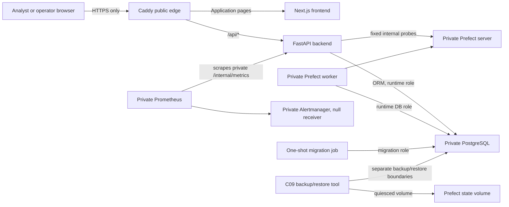
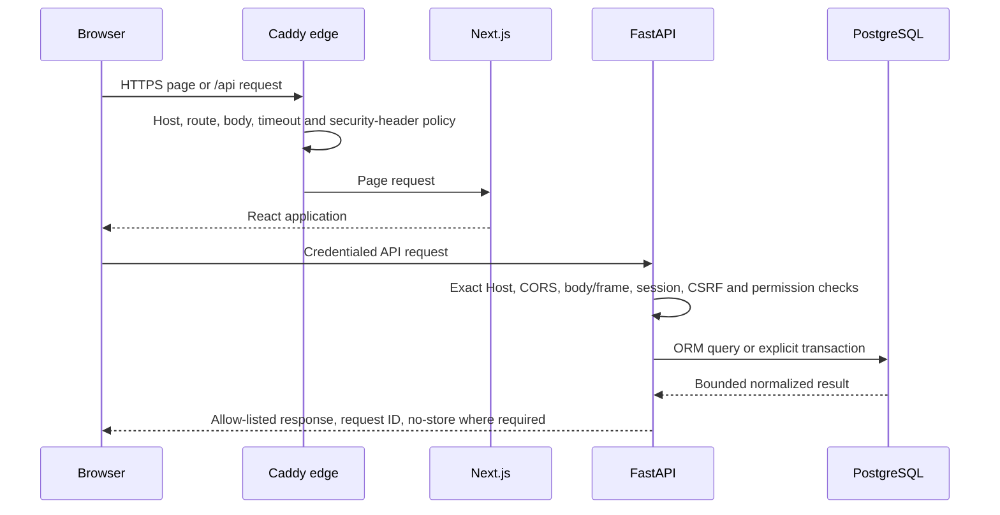
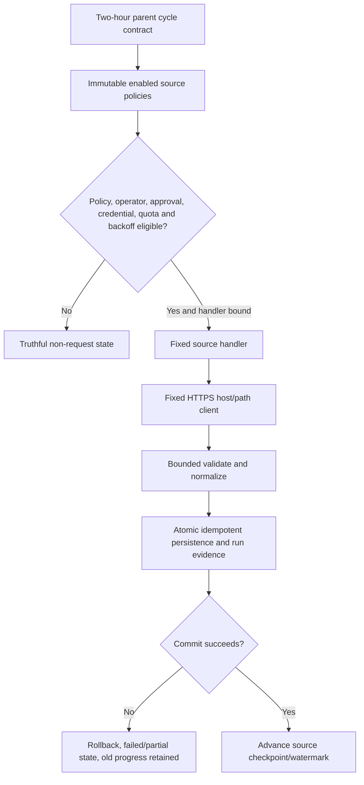

# Final architecture package

## Purpose and release identity

This document is the C11 architecture index for the Alpha Data / Cyber OSINT Dashboard local release candidate. Parent checkpoint: `beeba6522eeac8c9a361c52d17624f02d92da5f5`. The final C11 release-candidate commit is to be recorded after independent review and approved Git closure.

It reconciles the implemented component/trust/data flows without duplicating the detailed source documents. It does not claim mentor staging, public TLS, external alert delivery, off-host backup activation, scheduled-cycle observation, UAT, or measured production recovery.

Post-C11 PF-01/PF-02 local correction: development Compose now stores Prefect
metadata in a dedicated internal PostgreSQL service/volume and serves real UI
assets from the explicit non-root writable `/var/lib/prefect/ui` path. The old
local SQLite file remains untouched and no metadata migration is claimed. The
production-oriented topology and historical C09/C11 evidence below remain on
their documented SQLite volume architecture. The deployment stays paused and
the production source-handler mapping stays empty.

## Component map and deployment topology

Only Caddy publishes host ports. PostgreSQL, backend, frontend, Prefect, worker health, Prometheus, Alertmanager, and internal metrics remain private. Networks separate edge, database, orchestration, and monitoring traffic. Project services run non-root where supported with dropped capabilities/no-new-privileges, bounded resources/logs, health checks, and file-reference secrets.

## Trust boundaries

| Boundary | Untrusted side | Trusted control |
|---|---|---|
| Browser to edge | User input, cookies, external OSINT text/links | Caddy TLS/Host/routes/body/timeouts/headers; backend exact Host/CORS/CSRF/body limits |
| Frontend to API | Browser requests and public configuration | Same-origin credentialed client, strict request/response allow-lists, backend authorization |
| API to database | Validated request fields | SQLAlchemy expressions/ORM, explicit transactions, least-privilege runtime role |
| Ingestion to providers | Public provider responses | Fixed HTTPS host/path policy, no proxy inheritance, redirect rejection, bounded time/bytes/pages/objects |
| Source execution to persistence | Handler results/checkpoints | Typed contracts, per-source identity, idempotency, commit before progress, failure isolation |
| Operations to orchestration | User control intent | RBAC, Origin/CSRF, strict empty bodies, fixed slugs/actions, audit commit |
| Monitoring/administration | Internal health/metrics surfaces | Private networks, fixed probes/targets, no Caddy route |
| Backup/restore | Encrypted artifacts and recovery target | Strict metadata/checksum, separate roles, isolated names, tmpfs/plaintext bounds, no automatic cutover |

## Browser request and session flow

Authentication uses Argon2id credentials, opaque random browser sessions, SHA-256 token/CSRF hashes in the database, HttpOnly SameSite-Strict session cookies, separate CSRF cookie/header validation, idle/absolute expiry, active-session limits, account-wide invalidation, and generic failures. Staging/production require Secure cookies. Local roles map to a closed permission set; backend dependencies enforce authorization.

## Ingestion and source-policy flow

The production `DEFAULT_SOURCE_HANDLERS` mapping is empty in C11. Registry `enabled` metadata does not make a source live. The deployment is paused by default and activation requires staging, explicit controlled evidence, a valid fixed work pool, and all scheduled handler bindings. One source failure does not fail or overwrite unrelated source evidence.

Source clients accept no arbitrary API root, host, path, collection, redirect, header, cookie, callback, or proxy. Collection is metadata-oriented and excludes scanning, active probing, malware/binary retrieval, file submission, and exploit execution.

## Persistence, provenance, and checkpoint integrity

PostgreSQL stores normalized intelligence items, vulnerability extensions, sources/source records, identifiers, tags, indicators and relationships, operational cycles/runs/events/errors, source progress/rate state, local identity/session/RBAC, and immutable security audit events. Public APIs use UUIDs/slugs and allow-listed fields; raw vendor payloads, internal IDs, SQL, credentials, and private configuration are not exposed.

The transaction sequence is:

1. acquire deterministic cycle/run identity;
2. read current policy/progress/quota;
3. collect/validate before persistence where the source contract requires it;
4. write normalized records and reconciled run evidence in an explicit transaction;
5. commit;
6. advance progress with expected prior version;
7. recover `checkpoint_pending` safely if the process stops between steps 5 and 6.

Checkpoint advancement before committed persistence is prohibited. Duplicate execution reuses deterministic identities; conflicts fail closed.

## Frontend/backend boundary and release pages

The Next.js App Router frontend uses typed service clients and runtime response allow-lists. External text is rendered as React text. External links require canonical HTTPS/default-port/ASCII-host safe URL validation and protected link attributes. No `dangerouslySetInnerHTML` is used for OSINT data.

Official pages:

1. Overview;
2. Threat Feed;
3. Vulnerabilities;
4. UAE Intelligence;
5. IOC Search;
6. Ingestion Operations;
7. Sources;
8. Run History;
9. Reports;
10. System Health;
11. Audit Log;
12. Methodology.

The dashboard layout requires authentication. Permission-restricted navigation is projected in the frontend, while the API independently enforces roles. Loading, empty/unavailable, stale/disabled, sanitized error, success, and action-in-progress states remain distinct. Removed/backlog features have no release route or Coming Soon surface.

## Reporting and audit

Report catalog/read requires `report.read`; export requires `report.export`, CSRF/Origin, allow-listed report/format, and 1–100 rows. CSV formula/control prefixes are neutralized; PDF uses bounded plain canvas strings without HTML/remote resources; output is at most 2 MiB. Export returns only after audit evidence commits.

Audit search is Administrator-only, read-only, paginated, filter-bounded, UTC-aware, and returns safe event fields. Authentication/authorization denial, operator controls, account lifecycle, and report export use sanitized audit evidence.

## Health, monitoring, and edge

System Health returns exactly eight components: backend, database, Prefect server, Prefect worker, ingestion operations, source freshness, storage, and deployment identity. Unknown/disabled/stale/failure states never become healthy. Database failure makes overall health unhealthy; other required failures degrade it.

Caddy is the only public boundary, routing application paths to Next.js and `/api/*` to FastAPI while rejecting internal/admin path shapes. HTTPS owns HSTS/CSP and other browser headers; HTTP redirects to the exact HTTPS authority. The backend retains an independent 1,000,000-byte/1,024-frame limit and exact Host policy.

Prometheus scrapes only the private backend metrics route and has bounded retention. Alertmanager is private with a null receiver. External delivery and TLS-expiry probing require later approval.

## Backup and recovery boundary

C09 implements:

- separate least-privilege PostgreSQL backup access;
- custom-format `pg_dump` streamed to age without persistent plaintext;
- strict versioned metadata, checksum, head, and safe row-count evidence;
- restore only to isolated `alpha_data_restore_<safe-id>` targets;
- bounded mode-0600 `/dev/shm` temporary required by seekable archive restore;
- runtime-role and Alembic-head validation before `restore_state=validated`;
- quiesced Prefect volume backup and new-volume restore;
- traversal/link/device rejection and pinned no-network read-only validation;
- dry-run daily/weekly/monthly retention with explicit deletion confirmation;
- no automatic production cutover.

Local isolated operational evidence exists, but off-host transfer, mentor staging recovery, and measured production RPO/RTO remain manual gates.

## Security control map

| Control family | Implemented mechanisms | Primary evidence |
|---|---|---|
| Authentication/session | Argon2id, opaque session hashes, expiry/rotation/revocation | C06 audit; C10 matrix |
| Authorization/BOLA/BFLA | Closed roles/permissions, route dependencies, strict public identifiers | C06/C07 tests; C10 API inventory |
| CSRF/CORS/Host | exact Origin/CSRF, exact origins/hosts, strict methods/headers | Security notes; C10 API suite |
| Input/resource bounds | Pydantic/query bounds, 1 MB/1,024 frames, report/parser/page/object bounds | C10 API suite; C11 reliability |
| Injection | ORM/expression queries, fixed subprocess argv, CSV neutralization, bounded PDF | C10 injection suite |
| XSS/URL | React escaping, no unsafe HTML, strict HTTPS safe-link policy | C10 browser tests |
| SSRF/unsafe consumption | fixed hosts/paths, no proxy env, redirect rejection, time/byte/content bounds | C10 outbound matrix/suite |
| Integrity/idempotency | explicit transactions, deterministic keys, commit-before-progress | C10 logic; orchestration tests |
| Logging/errors/audit | allow-listed JSON, sanitized errors, immutable audit evidence | Security notes; C10/C11 tests |
| Supply chain/containers | exact manifests, CycloneDX SBOMs, digests, non-root/private networks | C10 supply-chain evidence |
| Backup/recovery | encrypted artifacts, strict restore/isolation, rehearsed contracts | C09 recovery package |

This mapping is evidence for the implemented scope, not blanket OWASP/ASVS certification.

## External and manual dependencies

- M20/B9-03: mentor-accessible staging, DNS/public TLS, external alert and off-host backup activation.
- M26/B11-02: role-based mentor UAT and actual scheduled-cycle observation.
- M28/B11-04/B11-05: final workbook/evidence reconciliation, mentor acceptance, and secure handover.
- Source-specific licences/approvals/credentials/quotas where applicable; none may be bypassed.

## Authoritative document index

| Topic | Document |
|---|---|
| Detailed application/data architecture | [`architecture.md`](architecture.md) |
| API fields, bounds, and errors | [`api-contract.md`](api-contract.md) |
| Security boundaries | [`security-notes.md`](security-notes.md) |
| Testing strategy | [`testing-plan.md`](testing-plan.md) |
| Production Compose operation | [`production-docker-deployment.md`](production-docker-deployment.md) |
| Environment and secrets | [`environment-and-secrets.md`](environment-and-secrets.md) |
| Source governance | [`source-integration-policy.md`](source-integration-policy.md), [`data-sources.md`](data-sources.md), [`uae-source-governance.md`](uae-source-governance.md) |
| C09 operations/recovery | [`c09-production-operations-recovery.md`](c09-production-operations-recovery.md), [`c09-recovery-runbook.md`](c09-recovery-runbook.md), [`c09-local-rehearsal-evidence.md`](c09-local-rehearsal-evidence.md) |
| C10 security audit | [`c10-security-audit.md`](c10-security-audit.md), [`c10-owasp-asvs-matrix.md`](c10-owasp-asvs-matrix.md), [`c10-api-security-inventory.md`](c10-api-security-inventory.md), [`c10-outbound-security-matrix.md`](c10-outbound-security-matrix.md) |
| Supply chain/SBOM | [`c10-supply-chain-evidence.md`](c10-supply-chain-evidence.md), [`../security/sbom/README.md`](../security/sbom/README.md) |
| C11 audit/checklist | [`c11-final-security-reliability-audit.md`](c11-final-security-reliability-audit.md), [`c11-release-candidate-checklist.md`](c11-release-candidate-checklist.md) |
